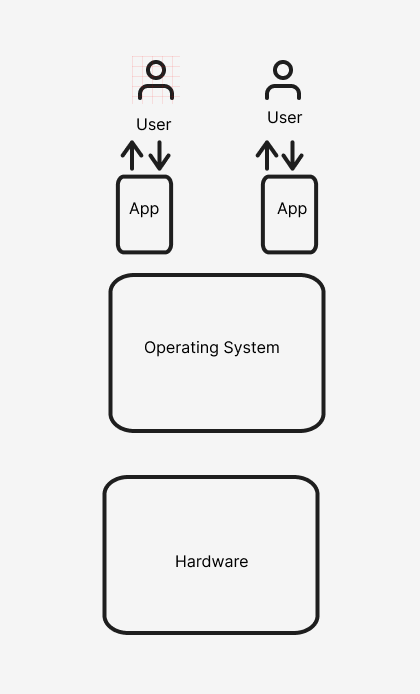
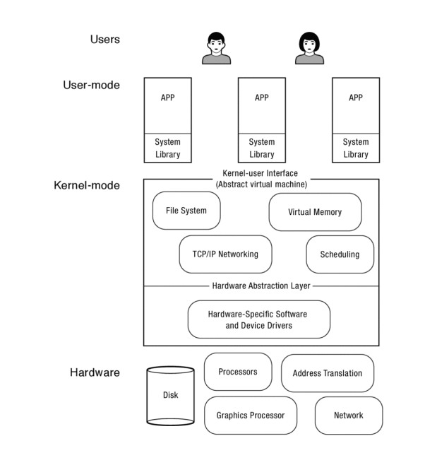
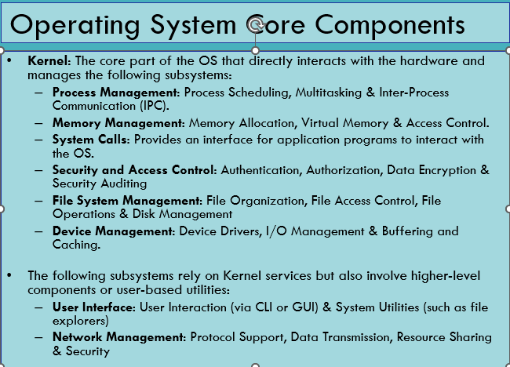
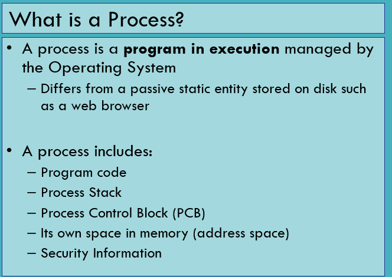

+++
title = 'Operating System TA'
date = 2024-11-14T01:05:42+08:00
draft = false
+++

# Operating System TA

### 此文档是为了让各位更好理解UWE-Neusoft操作系统课程的内容，其中经过阅读产出的解释会放上原文链接，此文档使用双语，便于各位复习考试。

## 目录

- [Basic Concept](#chapter-1-basic-concept)
  - [Related Concepts](#11-related-concepts)
    - [CPU](#111-cpu-中央处理器)
    - [Register](#112-register-寄存器)
    - [RAM](#113-ram-内存)
    - [Latency Numbers](#114-latency-numbers-every-programmers-should-know)
  - [Operating System Definition](#12-operating-system-definition)
  - [Kernel Abstraction](#13-kernel-abstraction)
  
- [Process & Threads](#chapter-2-process--threads)
  - [Process](#21-process)
    - [Processes and Execution of Program](#211-processes-and-execution-of-program)
    - [PCB](#212-pcb)
    - [Process state&Process Blocking &Context Switch](#213-process-state--process-blocking--context-switching)
  - [Threads](#22-threads)
    - [Process & Threads](#221-process-thread)
    - [User-level Threads vs Kernel-level Threads](#222-user-level-threads-vs-kernel-level-threads)
    - [IPC](#223-inter-prcocess-communication)
- [Concurrency](#chapter-3-concurrency)
  - [Concurrency Basic Theory](#31-concurrency-basics)
    - [Concurrency Explained](#311-什么是并发)
    - [Concurrency vs Parallelism](#312-并发与并行的区别)
    - [Why Concurrency](#313-为什么需要并发)
    - [Process Concurrency](#3141-进程process的并发)
    - [Threads Concurrency](#3142-线程thread的并发)
    - [Cocurrency Challenge](#315-并发带来的挑战)
      - [Race Condition](#3151-竞态条件race-condition)
      - [DeadLock](#3152-死锁deadlock)
      - [Starvation](#3153-饥饿starvation)
    - [Synchronization Primitives](#316-同步机制同步原语)
    - [Critical Section](#317-临界区critical-section)
    - [Concurrency Best Practice](#318-并发编程的最佳实践)
    - [Discussion between Mutex and Semaphores](#319-mutex-和-semaphore的使用争论)
  - [Case Study 1. Linux Concurrency](#32-case-study-1-concurrency-in-linux-kernel-development)
  - [Case Study 2. Xv6 Concurrency](#33-case-study-2-concurrency-inxv6-a-simple-operating-system)
  - [Related Concept](#34-related-concept-explaination)
- [System Calls](#chapter-4-system-calls)
  - [System Call Basics](#41-system-call-basic)
  - [System call mechanism](#42-system-call-mechanism)
  - [Wrapper](#43-wrapper)
  - [Error Handeling](#44-error-handling)
- [Memory Management](#chapter-5-memory-management)
   - [Address Translation, Memory Management Goals](#51-address-translation--memory-management-goals)
   - [Address Translation](#511-address-translation-explained)
   - [Goals for Memory Management](#512-goals-for-memory-management)
   - [Paged Memory](#52-paged-memory)
   - [Segmented Memory](#53-segmented-memory)
   - [Segmentation with Paging](#54-segmentation-with-paging)
   - [Page Replacement Algorithms](#55-page-replacement-algorithms)
      - [LRU](#551-lruleast-recently-used---最近最少使用)
      - [LFU](#552-lfuleast-frequently-used---最不常用)
      - [Real-world Example](#553-实际应用中的选择)
   - [Extended Reading](#56-extended-reading-address-translation-for-memory-allocation-algorithms)
## Chapter 1 Basic Concept
### 1.1 Related Concepts
#### **1.1.1 CPU 中央处理器**
CPU（Central Processing Unit，中央处理单元）是计算机的核心部件之一，负责执行计算机程序中的指令。它是计算机中的“大脑”，进行数据处理、运算、逻辑判断、控制指令执行等重要任务。简而言之，CPU负责将软件程序中的指令转化为计算机能够理解并执行的操作。

CPU 的主要工作包括：

- 指令执行：CPU 根据程序中给定的指令（比如加法、减法、逻辑判断等）进行操作。
- 数据处理：CPU 处理数据，进行算术运算、逻辑运算、数据传输等。
- 控制功能：CPU 控制计算机的各个部件，协调不同硬件的工作，以确保程序顺利运行。

--- 

#### **1.1.2 Register 寄存器**


**寄存器**（Register）是计算机中的一种 **高速存储器**，它位于 CPU 内部，专门用于存储和快速访问正在处理的数据和指令。与内存（RAM）相比，寄存器的访问速度非常快，因为它直接集成在 CPU 内部，但它的存储容量较小。寄存器在计算机的执行过程中扮演着至关重要的角色，尤其是在指令的解码、执行和数据操作方面。

寄存器的类型和作用

根据功能和使用方式，寄存器可以分为不同的类型。

#### 1. **数据寄存器（Data Registers）**
- **作用**：用于存储在运算过程中需要处理的数据。
- **示例**：在加法运算中，两个操作数可能会被加载到数据寄存器中，然后 CPU 对它们进行计算。

#### 2. **地址寄存器（Address Registers）**
- **作用**：存储内存地址，用于指示数据在内存中的位置。
- **示例**：当程序需要从内存中读取数据时，地址寄存器保存着数据所在的内存地址，CPU 使用该地址从内存中获取数据。

#### 3. **指令寄存器（Instruction Register, IR）**
- **作用**：存储当前正在执行的指令。
- **示例**：CPU 在执行程序时，会将程序中的指令加载到指令寄存器中进行解码，然后执行。

#### 4. **程序计数器（Program Counter, PC）**
- **作用**：存储下一条将要执行的指令的地址。
- **示例**：当 CPU 执行完当前指令后，程序计数器会自动更新，指向下一条指令的地址。

#### 5. **状态寄存器（Status Register）**
- **作用**：存储 CPU 的状态信息，包括算术运算的结果（如零标志、进位标志等）。
- **示例**：如果执行加法操作的结果为零，状态寄存器中的 **零标志** 会被设置为 1，表示运算结果为零。

#### 6. **通用寄存器（General Purpose Registers, GPR）**
- **作用**：供 CPU 用于存储临时数据或计算结果，通常用于数据处理。
- **示例**：例如在汇编语言中，可以使用通用寄存器保存操作数或者暂时存储中间计算结果。

#### 7. **浮点寄存器（Floating Point Registers）**
- **作用**：专门用于处理浮点数（即带有小数点的数字）的计算。
- **示例**：在执行浮点运算时，浮点寄存器存储浮点数的值。

**寄存器在 CPU 中的作用**

寄存器是 CPU 内部最关键的组成部分之一，它们直接影响计算机的运算效率和处理速度。以下是寄存器在 CPU 中的主要作用：

1. **高速存储**：
   - 寄存器是 CPU 内部最快的存储器，通常比缓存（Cache）和主存（RAM）更快。因为它们是 CPU 的一部分，所以可以在指令执行过程中实时访问。

2. **存储操作数和中间结果**：
   - 在 CPU 执行计算时，寄存器用于存储操作数和计算过程中的中间结果。例如，进行加法运算时，两个操作数和运算结果都可能保存在寄存器中。

3. **提高运算速度**：
   - 寄存器的高速存取特性显著提高了 CPU 的运算速度。每次计算指令时，数据如果保存在寄存器中，CPU 能够迅速地获取并进行计算，而不需要从较慢的内存中读取数据。

4. **指令调度与执行**：
   - **程序计数器**（PC）和 **指令寄存器**（IR）是 CPU 执行程序指令的核心部件。程序计数器指向下一条指令的地址，而指令寄存器则保存当前执行的指令。指令的取出、解码、执行是通过寄存器高效完成的。

5. **数据传递**：
   - 寄存器负责 CPU 内部和内存、外设之间的数据传递。通过寄存器，CPU 可以与内存中的数据进行交换，也可以与外设（如硬盘、显示器等）进行数据交换。

**寄存器的特性**

1. **速度快**：
   - 寄存器是 CPU 中的最重要部件，存取速度极快，通常是硬件直接支持的。

2. **容量小**：
   - 由于寄存器存储的是临时数据，它们的容量比内存要小很多。一个现代 CPU 通常只有几十到几百个寄存器，而内存的容量则是几 GB 或更多。

3. **专用性**：
   - 大多数寄存器有专门的用途，例如程序计数器（PC）和指令寄存器（IR）有固定的用途，不能随意改动；而通用寄存器则可以被程序灵活使用。

4. **易于访问**：
   - 由于寄存器直接位于 CPU 内部，CPU 可以非常迅速地访问和操作它们。

---

#### **1.1.3 RAM 内存**
### 什么是内存？

**内存**（Memory）是计算机中用于存储数据和指令的硬件设备，它为计算机提供临时存储空间，使得处理器（CPU）能够快速访问正在使用的数据和程序指令。内存是计算机运行时必不可少的组成部分，它的主要作用是提供程序和数据的存取，使得 CPU 能够在运行程序时不断地读取和修改数据。

在计算机中，内存有不同的类型，根据速度、容量、用途等因素进行区分。最常见的内存类型包括 **RAM（随机存取存储器）** 和 **ROM（只读存储器）**，以及一些特殊的高速缓存（如 **Cache**）和虚拟内存。

#### 内存的主要分类

#### 1. **RAM（随机存取存储器）**
- **作用**：RAM 是计算机的主内存，主要用于存储正在运行的程序和数据。RAM 可以随时读写，因此它被称为“随机存取”的内存。
- **特点**：
  - **易失性**：RAM 中的数据在计算机断电后会丢失，所以它被称为易失性内存。计算机重启后，内存中的数据会消失，操作系统和程序需要重新加载到内存中。
  - **读写速度快**：RAM 的访问速度相对较快，远远高于硬盘或固态硬盘（SSD）。
- **类型**：
  - **动态 RAM（DRAM）**：常见的 RAM 类型，具有较大的存储容量，但需要定期刷新以保持数据。
  - **静态 RAM（SRAM）**：速度更快，但容量较小，通常用于 CPU 缓存（L1、L2、L3 缓存）中。

#### 2. **ROM（只读存储器）**
- **作用**：ROM 是一种非易失性内存，存储的是计算机开机时需要的固化指令或数据，如 BIOS（基本输入输出系统）或固件。
- **特点**：
  - **非易失性**：ROM 中存储的数据即使断电也不会丢失。
  - **只能读取**：传统的 ROM 只能读取数据，不能像 RAM 那样随意写入。现代 ROM 如 **EPROM** 和 **EEPROM** 可以进行编程和擦除，但写入次数有限。

#### 3. **缓存（Cache）**
- **作用**：缓存是位于 CPU 和主内存之间的一种高速存储器，旨在提高 CPU 访问内存的速度。缓存存储着 CPU 频繁访问的数据或指令，避免了 CPU 每次都从较慢的 RAM 中获取数据。
- **特点**：
  - **极高的访问速度**：由于缓存速度远高于内存，它可以大大减少 CPU 等待内存访问的时间。
  - **小容量**：缓存的存储容量相较于 RAM 和硬盘非常小，但它能够极大地提高计算机的性能。
  - **多级缓存**：现代 CPU 通常配有多级缓存（L1、L2、L3 缓存），不同级别的缓存具有不同的容量和访问速度。

#### 4. **虚拟内存**
- **作用**：虚拟内存是计算机操作系统管理内存的一种方式，它使得计算机看起来拥有比实际物理内存更多的可用内存。虚拟内存通过将不常用的数据暂时存储在硬盘上来扩展内存空间。
- **特点**：
  - **硬盘与内存交换**：当物理内存不够用时，操作系统会将一些数据从 RAM 移动到硬盘的交换文件（Swap）或页面文件中，这个过程叫做 **分页**（paging）。
  - **提供更多空间**：虚拟内存允许程序使用比物理内存更多的空间，但由于硬盘速度远慢于内存，这会导致性能下降。

#### 内存的工作原理

1. **程序加载**：
   - 当你启动一个程序时，操作系统会将程序的代码和所需的数据从硬盘加载到内存中。操作系统会为每个程序分配一定的内存空间，使得程序可以在内存中运行。

2. **数据存取**：
   - CPU 通过访问内存中的数据来执行指令。内存是一个 **地址空间**，每个数据和指令都有一个唯一的地址，CPU 根据这些地址来读取或写入数据。
   - CPU 可以通过 **内存总线** 与内存进行通信，读取数据、存储数据或修改数据。

3. **缓存和内存层次结构**：
   - 由于 CPU 访问内存的速度远慢于寄存器和缓存，现代计算机通常采用层次化的内存结构，其中包括多个缓存（L1、L2、L3）以及主内存（RAM）。CPU 会首先尝试从速度最快的 L1 缓存中获取数据，如果没有找到，则依次从 L2、L3 缓存，最终从主内存中获取。

4. **虚拟内存的使用**：
   - 当程序需要更多内存时，操作系统会使用虚拟内存技术，将部分内存内容保存到硬盘上。这种做法能够扩展可用内存，但也会因硬盘访问速度慢而导致性能下降。

#### 内存与其他硬件的比较

| **硬件**  | **速度**  | **容量**  | **易失性**  | **用途**  |
|-----------|-----------|-----------|-------------|-----------|
| **寄存器** | 极快      | 极小      | 易失性       | 存储 CPU 当前处理的数据和指令 |
| **缓存（Cache）** | 很快      | 小        | 易失性       | 存储 CPU 常用的数据和指令，减少访问内存的延迟 |
| **RAM**   | 快        | 中        | 易失性       | 存储正在运行的程序和数据 |
| **ROM**   | 慢        | 小        | 非易失性     | 存储固化的程序和数据（如 BIOS） |
| **硬盘（HDD/SSD）** | 慢        | 大        | 非易失性     | 存储长期数据，如操作系统、程序和文件 |

---

#### **1.1.4 Latency Numbers Every Programmers Should Know**
在后续的课程开始之前，阅读此章节是有意义的，能让各位更直观的了解到不同的硬件的访问延迟速度的不同之处。
**"Latency Numbers Every Programmer Should Know"** 是一篇由 **John L. Hennessy** 和 **David A. Patterson**（计算机体系结构领域的两位权威人物）提出的文章，旨在帮助程序员了解不同硬件操作的延迟（latency）数字，并通过这些数字更好地优化程序的性能。文章中的数据主要描述了现代计算机系统中，常见硬件组件（如 CPU 寄存器、缓存、内存、硬盘等）的访问延迟。


#### 典型延迟数据

这些数字是针对典型硬件平台的延迟时间，按不同层级和硬件分类：

1. **CPU 寄存器**：
   - 访问延迟：**1ns**（极快）

2. **L1 缓存**（Level 1 Cache）：
   - 访问延迟：**1ns – 4ns**

3. **L2 缓存**（Level 2 Cache）：
   - 访问延迟：**3ns – 20ns**

4. **L3 缓存**（Level 3 Cache）：
   - 访问延迟：**10ns – 40ns**

5. **主内存（RAM）**：
   - 访问延迟：**50ns – 100ns**

6. **固态硬盘（SSD）**：
   - 访问延迟：**100µs**（微秒级别）

7. **机械硬盘（HDD）**：
   - 访问延迟：**5ms – 10ms**（毫秒级别）

8. **网络存储（如 NAS 或云存储）**：
   - 访问延迟：**10ms – 100ms**

这些数据帮助开发人员理解，在不同硬件和存储层次中，数据访问的速度差异是多么显著，尤其是在考虑性能优化时。程序员可以通过了解这些延迟数字来识别性能瓶颈，比如频繁地访问主内存、硬盘或者网络存储会导致程序的性能大幅下降。

#### 数据可信性

这些数字来自实际的硬件测试和研究，因此它们在一般情况下是具有很高的可信度的。不过，这些延迟数字是 **典型值** 或 **平均值**，并且会受到不同硬件平台、处理器架构、存储设备类型等因素的影响。也就是说，不同的计算机系统可能会有所不同，特别是在新的硬件和存储技术（如 NVMe SSD、Optane 存储）出现时，延迟时间可能会有所变化。

另外，**操作系统** 和 **硬件配置**（如内存大小、缓存层次、硬盘类型、网络带宽等）都会对实际性能产生影响，因此这些延迟数字可以作为参考，但并不意味着每种硬件都严格符合这些标准。

#### 为什么这些数据重要？

1. **性能优化**：了解这些延迟数字能够帮助开发人员在程序中进行优化，避免不必要的性能瓶颈。例如，频繁访问主内存会比访问 CPU 缓存慢得多，因此程序应尽量减少内存访问的频率，并尝试使用缓存。

2. **设计高效算法**：程序员可以通过了解存储层次的延迟，选择合适的数据结构和算法，最大限度地提高程序的运行效率。例如，当设计缓存策略时，知道 L1 和 L2 缓存的访问速度差异可以帮助设计高效的缓存替换算法。

3. **硬件依赖性**：这些延迟数据有助于程序员理解程序在不同硬件平台上运行的行为，尤其是在进行性能调优时。这些数字帮助程序员识别哪些硬件是性能瓶颈，并做出相应的优化。

4. **虚拟内存和磁盘I/O**：在虚拟内存管理和文件系统设计中，理解硬盘和主内存之间的延迟差异至关重要。通过了解硬盘延迟是如何影响性能的，程序员可以更好地设计内存分页、缓存和数据交换机制。

推荐大家使用此链接的图来直观观察1990-2020年访问速度的差异： https://colin-scott.github.io/personal_website/research/interactive_latency.html

___

### 1.2 Operating System Definition
> An Operating System (OS) is software that acts as an interface between the computer hardware and the user or application software. It manages hardware resources and provides essential services for the execution of programs. (From **lecture 10**)

我们如何来理解上面这段话？

当我们想要更全面理解一个定义时，一个通常比较好的方法是查看其他书籍和行业先驱对个概念的定义和理解，找到不同定义的相同点，进而形成一个准确又直观的感受框架，再将我们学习到和接触到的知识放入框架中一步一步完善。我们尝试从另外两本比较优秀的教材中理解这一定义。

**定义1**

> The job of an operating system is to share a computer among multiple programs and to provide a
more useful set of services than the hardware alone supports. An operating system manages and
abstracts the low-level hardware, so that, for example, a word processor need not concern itself
with which type of disk hardware is being used. An operating system shares the hardware among
multiple programs so that they run (or appear to run) at the same time. Finally, operating systems
provide controlled ways for programs to interact, so that they can share data or work together.

**中文翻译版：**

> 操作系统的任务是将计算机资源在多个程序之间进行共享，并提供比硬件本身支持的功能更为丰富的服务。操作系统管理和抽象了底层硬件，例如，使得文字处理器无需关心正在使用哪种类型的磁盘硬件。操作系统将硬件资源在多个程序之间共享，使它们可以同时运行（或看起来像同时运行）。最后，操作系统提供了受控的方式供程序之间进行交互，使它们能够共享数据或协同工作。

(*xv6, a simple, Unix-like teaching operating system, Russ Cox Frans Kaashoek Robert Morris*, September 6, 2021)

**定义2：**
> An operating system (OS) is the layer of software that manages a computer’s resources for
its users and their applications. Operating systems run in a wide range of computer
systems. They may be invisible to the end user, controlling embedded devices such as
toasters, gaming systems, and the many computers inside modern automobiles and
airplanes. They are also essential to more general-purpose systems such as smartphones,
desktop computers, and servers.

**中文翻译版**

> 操作系统（OS）是管理计算机资源的软体层，负责为用户及其应用程序提供服务。操作系统运行于各种计算机系统中。它们可能对最终用户是不可见的，控制着嵌入式设备，如烤面包机、游戏系统以及现代汽车和飞机中的许多计算机。它们对更通用的系统，如智能手机、桌面计算机和服务器，也是至关重要的。

（*Operating Systems Principles & Practice， Thomas Anderson, Mike Dahlin*）

从以上三种定义我们可以看出操作系统的核心概念：
  
- 操作系统是管理计算机硬件资源(hardware resources)的**软件**。
- 作为硬件和**用户**的中介角色，为用户提供对硬件直接操作的直观服务。
- 作为硬件和**用户程序**的中介角色，为用户提供对硬件间接操作的直观服务。
- 提供**可控制的程序交互**，使得不同的程序可以共享数据和一起工作。



**Figure 1.1 general-purpose operating system**:  这张图可以从整体描述用户和计算机硬件之间的关系，一般而言，用户与软件应用（app)进行交互，而这些app运行在操作系统搭载的环境中，而操作系统作为一个中介来跟底层的硬件交互。
我们看一下这张简单图示的扩展版
 （***Figure 1.3 Operating Systems Principles & Practice， Thomas Anderson, Mike Dahlin***)

这张图更详细的描述了操作系统的功能，在最低层，硬件提供了处理器（Processors, Graphics Processor)、内存(Memory)以及一组用于存储数据(Disk)和与外界通信的设备(Network)。硬件还提供了一些基本操作，供操作系统用于故障隔离和同步(fault isolation and synchronization)。操作系统运行在计算机上作为最低层的软件。它包含一个用于管理各种硬件设备的设备专用层（device-specific layer），以及一组提供给应用程序的设备无关服务（device-independent services）。由于操作系统必须隔离恶意和有漏洞的应用程序，防止它们干扰其他应用程序或操作系统本身，因此操作系统的大部分运行在一个与应用程序代码分离的、受到保护的执行环境中。此外，操作系统的一部分也可以作为系统库运行，并链接到每个应用程序中。
反过来，应用程序运行在由操作系统内核提供的执行上下文中。这个应用程序上下文不仅仅是硬件设备之上的一个简单抽象；它是一个虚拟环境，具有以下特点：

- 更加受限：为了防止对系统的破坏。
- 更加强大：以掩盖硬件的局限性。
- 更有用：通过提供常用服务，使应用程序更易开发和运行。

著名的 *Operating Systems Principles & Practice* 将操作系统描述为三种角色裁判（Referee)、幻术师（Illusionist)、胶水（Glue）。为避免太多信息对各位的阅读造成麻烦，我只简要摘录这三种角色的功能：


1. **裁判（Referee）**  
   操作系统管理在**同一台物理机器**上运行的**不同应用程序**之间共享的资源。例如，操作系统可以停止一个程序并启动另一个程序。操作系统将应用程序彼此隔离，因此，一个应用程序中的错误不会破坏在同一机器上运行的其他应用程序。操作系统还必须保护自身及其他应用程序免受恶意计算机病毒的攻击。由于应用程序共享物理资源，操作系统需要决定哪些应用程序可以获得哪些资源以及何时获取。
   我们可以尝试列举操作系统作为裁判的功能：

- **资源分配**：
  - 操作系统负责管理有限的硬件资源（如处理器、内存、网络带宽和磁盘空间），确保多个程序能合理共享资源。
  - 通过分配资源，避免某个程序陷入死循环导致整个系统卡死。
  
- **隔离（Fault Isolation）**：
  - 操作系统隔离不同应用程序，使得一个程序的错误不会影响其他程序或系统本身。
  例如
  ```
  while(true){
   ;
  }
  ```
  这种类型的代码如果在整个系统中运行，那么它会让整个系统崩溃，但是如果是隔离开的单个运行环境运行，那它就不会影响其他程序，也能强制停止。
  - 防止恶意程序或漏洞危害其他应用程序或用户数据。
- **通信**：
  - 在隔离的基础上，操作系统允许应用程序间安全、受控地通信，例如协作完成复杂任务。
  - 操作系统在设置边界时，也要支持必要的跨边界通信。


2. **幻术师（Illusionist）**  
   操作系统通过对物理硬件的抽象，简化了应用程序的设计。编写一个“Hello, world!”程序时，你不需要（也不想）考虑系统有多少物理内存，或者有多少其他程序可能在共享计算机的资源。相反，操作系统提供了一种**近乎无限内存**的幻觉，即使物理内存有限。同样，它们还提供了每个程序独占计算机处理器的幻觉，而实际情况显然不同！这种幻觉让你可以在不依赖系统物理内存大小或处理器数量的情况下编写应用程序。由于应用程序是基于更高层次的抽象编写的，操作系统可以在后台无形地改变分配给每个应用程序的资源量。
   我们可以尝试总结一下操作系统作为幻术师的职能：

- **虚拟资源**：
  - 操作系统虚拟化物理资源（如处理器、内存、磁盘等），提供例如“无限内存”或“专属处理器”的假象。
  - 例如，操作系统将有限的物理内存抽象为几乎无限的虚拟内存。
- **错误屏蔽**：
  - 对无线网络丢包或磁盘设备的物理限制进行屏蔽，让程序员感知不到底层硬件问题。
- **虚拟机**：
  - 操作系统还可以虚拟化整个计算机，使得操作系统本身可以运行在另一个操作系统上（虚拟机）。
  - 虚拟机提高了应用的可移植性，例如旧系统程序可以在新硬件上运行虚拟机实现兼容。
通过这些“幻象”，操作系统为开发者提供了比底层硬件更方便和灵活的编程接口。

  
3. **胶水（Glue）**  
   操作系统提供了一组通用服务，以便应用程序之间可以方便地共享资源。因此，剪切和粘贴可以在整个系统中统一工作；一个应用程序写入的文件可以被另一个应用程序读取。许多操作系统还提供了通用的用户界面例程，使得应用程序可以具有相同的“外观和风格”。最重要的是，操作系统提供了一层将应用程序与硬件输入/输出（I/O）设备隔离的抽象层，因此应用程序的编写无需依赖于特定的键盘、鼠标或磁盘驱动器，而是可以独立于具体的硬件设备运行。 
   我们可以尝试总结一下操作系统作为胶水的职能：
- **标准化服务**：
  - 操作系统提供标准接口（如文件操作、内存管理、网络通信），屏蔽底层硬件的复杂性。
  - 例如，网络服务器可以专注于处理请求，而无需关心数据包的格式化。
- **促进共享**：
  - 通过标准化格式和管理方式，应用程序可以共享文件或数据（如文件系统的标准化、共享内存）。
- **设备抽象**：
  - 操作系统统一抽象了各种硬件设备（如网络接口、磁盘驱动、传感器等），让应用程序无需关心设备的具体实现。
- **用户界面库**：
  - 提供图形用户界面（GUI）组件，确保应用程序具有一致的外观和用户体验。
---

而评价操作系统的好坏要依靠以下几种标准：
**可靠性和可用性(Reliability and Availability)**、**安全性(Security)**、**可移植性(Portability)**、**性能(Performance)**、**采纳情况（Adoption）**。我们可以简单通过以下几个问题来让自己快速了解这些标准代表了什么。

- **可靠性和可用性**：操作系统能否按照你的需求工作？

- **安全性**：操作系统是否容易被攻击者破坏？

- **可移植性**：操作系统是否容易移植到新的硬件平台？

- **性能**：用户界面的响应是否及时，还是操作系统带来了过多的开销？

- **采纳情况**：有多少用户在使用这个操作系统？

不同的操作系统总是在以上几个评价标准中做*trade-off*。
（此章节来自*Operating Systems Principles & Practice*）

各位可以使用上述的概念来更好地理解 Lecture 10 page 4的内容（这些机制是什么，在老师的script里面已经有提及，我主要是为了解释为什么有这些机制），也可以将此页PPT作为我们的outline来使用：

### 1.3 Kernel Abstraction
操作系统最主要的机制就是保护系统的内部——防止一些错误操作的用户或者程序影响其他的程序或者操作系统本身。保护机制其实满足了我们之前的部分评价标准：
**可靠性(Reliability)**
保护机制可以防止一个程序中的错误导致其他程序或操作系统崩溃。在用户看来，系统崩溃似乎是操作系统的错，即使问题的根本原因可能是某个应用程序或用户的意外行为。因此，为了实现高系统可靠性，操作系统必须具有自我保护能力，能够在不论应用程序或用户行为如何的情况下正确运行。

**安全性(Security)**
某些系统上的用户或应用程序可能并不完全可信，因此操作系统必须限制它们的操作范围。没有保护机制，恶意用户可能会秘密更改应用程序文件，甚至操作系统本身，而用户对此一无所知。例如，如果一个恶意应用程序能够直接写入磁盘，它可能会修改包含操作系统代码的文件；下次系统启动时，被修改的操作系统就会加载，可能会安装间谍软件并禁用病毒保护功能。为了确保安全性，操作系统必须防止不受信任的代码修改系统状态。

**隐私(Privacy)**
在多用户系统中，每个用户只能访问她被允许的数据。如果没有操作系统提供的保护，任何用户或运行在系统上的应用程序都可以在数据拥有者不知情或未批准的情况下访问任何人的数据。例如，黑客经常利用流行应用程序（如游戏或屏幕保护程序）作为获取智能手机或笔记本电脑上存储的个人电子邮件、电话号码和信用卡数据的途径。为了保护隐私，操作系统必须防止不受信任的代码访问未经授权的数据。

**公平资源分配（Fair Resource Allocation)**
保护机制对于实现有效的资源分配也至关重要。如果没有保护机制，应用程序可以随意占用任意数量的处理时间、内存或磁盘空间。在单用户系统中，错误的应用程序可能会阻止其他应用程序运行，或使它们运行得极其缓慢，以至于看起来似乎卡住了。在多用户系统中，一个用户可能会占用系统的所有资源。因此，为了效率和公平，操作系统必须能够限制分配给每个应用程序或用户的资源量。

**Kernel的作用？**

实现保护是操作系统内核（**Kernel**)的工作。内核是系统上运行的最低级别的软件，它拥有对所有机器硬件的完全访问权限。内核必须被信任，可以对硬件进行任何操作。而其他所有的软件——也就是运行在系统上的不受信任的软件——都运行在一个受限的环境中(也即除了内核之外所有的软件都是不受信任的软件），无法完全访问硬件的全部功能。

应用程序本身通常也需要安全地执行不受信任的第三方代码。一个例子是网页浏览器执行嵌入的 JavaScript 来渲染网页。如果没有保护机制，包含病毒的脚本可以接管浏览器，让用户误以为他们是在直接与网页交互，但实际上他们的网页密码正在被转发给攻击者。

这种设计模式——可扩展应用程序运行第三方脚本——在许多不同领域都存在。如果第三方开发者和用户可以定制应用程序，那么这些应用程序就会变得更强大并得到更广泛的使用，但这样做也带来了如何保护应用程序免受恶意扩展攻击的问题。


## Chapter 2 Process & Threads
***本章节的顺序稍微不同于课程顺序，将先解释什么是 Process，然后再解释Process Management相关的问题。**
### 2.1 Process
首先我们回顾一下课程上关于进程（Process)的定义：

在课件中，"Program in execution" 指的是在运行中的程序，它是一个在执行的实体，不是一个静态存储的物体，这是一个非常重要的概念，只有了解了这个概念，才能明白进程的存在意义。

#### 2.1.1 Processes and Execution of Program
**进程** （process)是一种执行受限权限的应用程序实例，是操作系统内核提供的一种受保护的执行抽象。在执行过程中，进程必须经过操作系统内核的授权才能完成某些操作（所以需要security information)，例如访问其他进程的内存、读写磁盘或修改硬件设置。这意味着操作系统内核会介入并验证每个进程对硬件资源的访问，以确保安全性和稳定性。

#### **进程的执行与存续：从程序到进程的转换**
在计算机系统中，一个进程的产生和执行可以从程序的运行过程来理解。程序员通常使用高级编程语言编写代码，这些代码（process code)由**编译器（compiler）**转换成机器指令（machine instructions），最终和程序的数据（static data, process data)为一个文件，即**可执行映像（executable image）**。

运行一个程序时，**操作系统**会将可执行映像中的指令和数据加载到**物理内存（physical memory）**中。同时，它会分配内存中的两个区域来支持程序的运行：
1. **执行栈（execution stack）**：用于保存函数调用时的局部变量和调用状态。
2. **堆（heap）**：用于存储动态分配的数据结构(**malloc()** in C)。

而且操作系统本身也需要驻留在内存中，并且拥有自己的栈和堆，用于管理系统资源和运行用户进程。

当程序被加载到内存后（**如果已经通过保护阶段**），操作系统可以通过初始化程序的**栈指针**（stack pointer）并跳转到程序的第一条指令，开始程序的执行。

#### **多进程与资源管理**
同一程序可以同时运行多个副本。为此，理想情况下操作系统会在内存中为每个副本创建独立的指令、静态数据、堆和栈的副本。然而，大多数现代操作系统会优化内存使用，对于同时运行的多个副本，仅存储一份共享的程序指令，而数据、堆和栈则需要为每个实例单独分配。为了简化讨论，我们可以假定操作系统为每个进程提供完整的程序副本。

所以，**进程可以被看作是程序的一个执行实例（instance）**。一个程序（program)可以没有运行的进程，也可以同时存在一个或多个执行的进程。每个程序实例都会作为独立的进程在内存中存在，拥有其独立的数据副本。
#### 2.1.2 PCB
为了管理这些进程，操作系统使用了一种称为**进程控制块（Process Control Block, PCB**的数据结构。PCB存储了与进程相关的所有关键信息，例如进程在内存中的位置、可执行映像在磁盘上的存储位置、请求运行该进程的用户信息、以及进程的权限（privileges）等。

我们的课件中将PCB详细的列举出来：
- Process ID (PID): A unique identifier for the process.
- Process State: The current state of the process.（Start/Ready/Running/Waiting/Terminated)
- Program Counter: 指向下一条将要执行的指令的内存地址
- CPU Registers: All register values for managing context switching.
  CPU寄存器字段保存进程的上下文，包括所有的通用寄存器（如AX, BX, CX, DX等，具体取决于CPU架构）和特殊寄存器（如Program Counter（PC）、Stack Pointer（SP）、Flags寄存器等）。当进程切换时，操作系统会将当前进程的寄存器状态保存在PCB中，以便稍后再将它们恢复到CPU中。（而program counter和之前提到的stack pointer也是寄存器的一种）
  我们引用 （*xv6: a simple, Unix-like teaching operating system*）和（*Linux Kernel Development (3rd Edition)*）的原文来让各位知道为什么需要CPU Registers：
  >Threads of execution, often shortened to threads, are the objects of activity within the
process. Each thread includes a unique program counter, process stack, and set of processor registers.The kernel schedules individual threads, not processes.
（***Linux Kernel Development (3rd Edition)***）

   > When a process is not executing, xv6 saves its CPU
registers, restoring them when it next runs the process.

  >Switching from one thread to another involves saving the old thread’s CPU registers, and restoring the previously-saved registers of the new thread; the fact that the stack pointer and program counter are saved and restored means that the CPU will switch stacks and switch what code it is executing.（***xv6: a simple, Unix-like teaching operating system***）
- Scheduling Information: Priority of the process
Memory Management: Details about memory allocated to the process (e.g., page tables, segment tables).
- Allocated Resource: Information on I/O devices, files opened by the process.
#### 2.1.3 Process State & Process Blocking & Context Switching
此章节只做简要解释便于各位理解，请查看老师课件了解完整内容。
- **Process State**: 进程的状态描述了进程在其生命周期中的当前阶段，常见的状态包括**开始（start)、就绪（Ready）**、**运行（Running）**和**阻塞（Blocked or Waiting）、结束（Terminated)**。当进程获得CPU并执行时，它处于运行状态；当被挂起等待某个事件时（如I/O完成），进入阻塞状态；当它准备好但尚未被CPU调度时，处于就绪状态。

- **Process Blocking**: 当进程无法继续执行（通常由于需要等待某个资源或事件，比如I/O操作完成或获取某个锁），它会被阻塞，进入阻塞状态。此时，操作系统会把它从运行队列中移除，并在等待条件满足时才将其重新置为就绪状态。

- **Context Switching**: 当操作系统从一个进程切换到另一个进程时，它会执行**上下文切换**。这涉及保存当前进程的状态（如寄存器、程序计数器等），并加载另一个进程的状态，从而让新的进程在CPU上运行。这种机制使操作系统能够在不同进程之间公平地分配CPU时间并有效管理系统资源。


当进程被**阻塞（Blocking）**时，操作系统会触发**上下文切换（Context Switching）**，将CPU资源分配给其他处于**就绪（Ready**状态的进程，从而保持系统的高效运行。这些概念共同确保多任务操作系统能够管理和调度进程，使系统资源得到合理利用。
#### 2.1.4 Case Study 1: xv6 for context Switching
在 **xv6(一种教学用操作系统）** 中，上下文切换是内核进程调度机制的一部分，实现过程大致如下：

1. **保存当前进程的状态**：当内核决定执行上下文切换（比如当一个进程被阻塞，或者调度器决定切换到另一个进程时），会先保存当前进程的状态。这包括CPU寄存器的内容、程序计数器（Program Counter）和栈指针（Stack Pointer）等信息。这些状态信息被存储在当前进程的进程控制块（Process Control Block, PCB）中。

2. **选择下一个进程**：**调度器（Scheduler）** 选择下一个可以运行的进程。这是通过从就绪进程列表中挑选一个进程来完成的。

3. **恢复新进程的状态**：调度器将选定进程的状态加载到CPU寄存器中，包括程序计数器和栈指针，从而恢复进程的执行状态。这样，新进程从它上次被暂停的地方继续执行。

4. **切换过程**：实际的上下文切换代码通常使用汇编语言编写，以处理保存和恢复寄存器值的底层细节。在 xv6 中，`swtch` 函数是执行上下文切换的关键部分，它负责将CPU上下文从一个进程切换到另一个进程。

**xv6 中的具体步骤**：
- **调度器（scheduler）** 在一个循环中遍历所有进程，并使用 `swtch` 函数进行上下文切换。
- 进程的状态会被适当更新（例如，将旧进程标记为“等待”或“就绪”，并将新进程标记为“运行”）。
- 上下文切换确保当新进程开始运行时，它能无缝恢复，像之前一直在使用CPU一样，其栈和程序计数器都被正确恢复。这种机制使得 xv6 能够在多个进程之间高效切换，实现多任务处理。

#### 2.1.5 Case Study 2: Linux for context Switching
此章节我们采用 *(Linux Kernel Developement 3rd Edition)* 原文：

在Linux系统中，它由 `context_switch()` 函数在 `kernel/sched.c` 中定义。当选择一个新进程运行时，`schedule()` 函数会调用 `context_switch()`。这个函数完成两项基本工作：

1. 调用在 `<asm/mmu_context.h>` 中声明的 `switch_mm()`，将虚拟内存映射从前一个进程切换到新进程。
2. 调用在 `<asm/system.h>` 中声明的 `switch_to()`，将处理器状态从前一个进程切换到当前进程。这涉及保存和恢复栈信息、处理器寄存器以及其他架构特定的状态，这些状态必须按进程进行管理和恢复。

然而，内核必须知道何时调用 `schedule()`。如果只有在代码显式调用时才执行 `schedule()`，用户空间程序可能会无限运行。为了解决这个问题，内核使用 `need_resched` 标志来指示是否应进行重新调度（如表 4.1 所示）。当一个进程需要被抢占时，`scheduler_tick()` 会设置这个标志；当一个优先级高于当前运行进程的进程被唤醒时，`try_to_wake_up()` 也会设置这个标志。内核会检查该标志，发现其被设置后，会调用 `schedule()` 切换到一个新进程。这个标志向内核传递一个信号，表示调度器应尽快被调用，因为有另一个进程更需要运行。

在返回用户空间或从中断返回时，会检查 `need_resched` 标志。如果该标志被设置，内核会在继续运行之前调用调度器。

这个标志是针对每个进程的，而不是简单地设置为全局变量，因为访问进程描述符中的值比访问全局变量更快（这是由于访问当前进程描述符的速度较快，并且其很有可能已经被缓存）。在历史上，这个标志在 2.2 版本内核之前是全局的。在 2.2 和 2.4 版本中，这个标志是 `task_struct` 结构中的一个 `int` 变量。在 2.6 版本中，它被移动到 `thread_info` 结构中的一个特殊标志变量的单个位中。
### 2.2 Threads
#### **2.2.1 Process, Thread**
**线程（Thread）**，也被称为执行线程，是进程内部的活动对象，代表一个独立的控制流。每个线程都包含一个独特的程序计数器（Program Counter）、进程栈（Process Stack）以及一套处理器寄存器（Processor Registers）。在现代操作系统中，内核对线程进行调度，而不是对整个进程进行调度。

#### **线程的基本特征与结构**
1. **独立性与共享资源**：每个线程都有自己独立的执行上下文，包括独立的程序计数器、栈空间和寄存器集。这允许线程在进程内部独立运行和切换，而不影响其他线程的执行状态。同时，线程共享所在进程的资源，例如进程地址空间、全局变量、文件描述符和虚拟内存，这使得线程间通信和数据共享更加高效。
   
2. **虚拟化的处理器与虚拟内存**：操作系统虚拟化了处理器和内存，给每个进程（以及线程）一种独占系统资源的假象。虽然系统中的处理器可能会被成百上千个进程共享，但每个线程都感觉自己在单独运行。线程共享进程的虚拟内存，因此能够访问同样的数据和资源，但每个线程都有自己的虚拟化处理器状态。

#### **线程与进程的关系**
- **传统Unix系统**：一个进程通常只有一个线程，负责执行该进程的指令。
- **现代系统**：多线程程序（即包含多个线程的程序）变得普遍，一个进程可以包含多个线程，这些线程可以并发执行，提高程序的性能和响应能力。
- **Linux系统的实现**：Linux将线程视为一种特殊类型的进程。每个线程在本质上也是一个可独立调度的进程。

#### **线程的栈管理**
- 每个进程拥有两个栈：用户栈（User Stack）和内核栈（Kernel Stack）。
- 当进程执行用户态指令时，使用用户栈；当进程进入内核态（例如，进行系统调用或处理中断）时，使用内核栈。
- 内核栈独立于用户代码，且受到保护，即使用户栈出错或损坏，内核依然能够安全地执行。这种设计确保内核的稳定性与安全性。


每个进程都可以被视为一个具有受限权限的程序实例，同时肩负执行任务和提供保护两大职责。这些职责足够重要，因此需要分别进行深入讨论。

对于某些程序而言，它们需要支持**多线程（multi-threading）**。例如，网络浏览器可能需要同时处理用户输入、渲染屏幕内容和接收网络数据。这些任务可以划分为多个线程（threads），每个线程有独立的程序计数器和栈，但共享进程的代码和数据。操作系统通过类似管理多进程的方式来管理一个进程内的多线程，从而实现高效并发运行。
#### 2.2.2 **User Level Threads vs Kernel Level Threads.**


**什么是User Level Thread和Kernel Level Thread？**

- **User Level Thread（用户级线程）**：线程的创建、同步和调度在用户空间完成，内核对线程的存在一无所知。线程库在用户空间实现线程管理。
可以当作是一种内核级别线程的模拟。
- **Kernel Level Thread（内核级线程）**：线程由内核直接支持和管理，内核维护线程的上下文信息，负责线程的调度和同步。

**它们有什么区别？**

1. **开销和效率**：
   - 用户级线程的线程操作不需要内核干预，开销小，速度快。
   - 内核级线程的线程操作需要系统调用，开销大。

2. **调度**：
   - 用户级线程的调度由线程库管理，无法利用多处理器。
   - 内核级线程由内核调度，可以在多个处理器上并行执行。

3. **阻塞问题**：
   - 在用户级线程中，一个线程的阻塞系统调用可能导致整个进程阻塞。
   - 内核级线程中，一个线程阻塞不会影响其他线程。

4. **实现复杂度**：
   - 用户级线程实现复杂，需要解决调度和同步问题。
   - 内核级线程由操作系统提供支持，实现相对简单。

**《xv6, a simple operating system》中的线程**

xv6没有直接支持用户级线程，但可以通过进程模拟线程，或者在用户空间实现简易的线程库。

**《Operating System: Principles & Practice》中的线程**

书中详细讨论了线程的概念，包括用户级线程和内核级线程的实现方式和差异。

**使用`setjmp`和`longjmp`实现用户级线程：**

```c
#include <stdio.h>
#include <stdlib.h>
#include <setjmp.h>

#define MAX_THREADS 2

jmp_buf env[MAX_THREADS];
int current_thread = 0;

void thread_func1() {
    printf("Thread 1: Start\n");
    longjmp(env[1], 1); // 切换到线程2
}

void thread_func2() {
    printf("Thread 2: Start\n");
    longjmp(env[0], 1); // 返回主线程
}

int main() {
    if(setjmp(env[0]) == 0) {
        // 保存主线程环境，初次调用返回0
        thread_func1(); // 启动线程1
    } else if(setjmp(env[1]) == 0) {
        // 保存线程1环境，返回0
        thread_func2(); // 启动线程2
    }
    printf("Main Thread: End\n");
    return 0;
}
```

**代码Explain：**

- `setjmp`和`longjmp`用于保存和恢复执行环境，实现非对称协程。
- `env`数组保存不同线程的环境。
- `thread_func1`和`thread_func2`模拟线程的执行，使用`longjmp`切换。

**《Linux Kernel Development》中的线程**

书中详细介绍了Linux内核中的线程实现，Linux将线程和进程统一为任务（task），线程由轻量级进程（Lightweight Process）实现。

**内核级线程示例（使用POSIX线程）：**

```c
#include <pthread.h>
#include <stdio.h>
#include <stdlib.h>

void *thread_func(void *arg) {
    printf("Hello from thread!\n");
    pthread_exit(NULL); // 退出线程
}

int main() {
    pthread_t thread;
    int rc;

    rc = pthread_create(&thread, NULL, thread_func, NULL); // 创建新线程
    if(rc) {
        printf("Error: Unable to create thread, %d\n", rc);
        exit(-1); // 退出程序
    }

    pthread_join(thread, NULL); // 等待线程完成
    printf("Thread has finished execution\n");
    return 0;
}
```

**代码解释：**

- `pthread_create`创建一个新线程，执行`thread_func`函数。
- `pthread_exit`在线程函数中退出线程。
- `pthread_join`在主线程中等待新线程完成，确保线程的正确终止。

---

**《Linux Kernel Development》中的用户级线程**

《Linux Kernel Development》主要聚焦于Linux内核的设计与实现，包括进程管理、内存管理、设备驱动等。在线程方面，书中深入讨论了Linux内核对线程和进程的支持，以及它们在内核中的实现方式。

在Linux中，线程和进程的概念被统一对待，都是由内核中的`task_struct`结构表示。Linux使用轻量级进程（Lightweight Process，LWP）来实现线程，即通过`clone()`系统调用创建共享资源的进程。因此，Linux的线程本质上是由内核管理的内核级线程。

**关于用户级线程**

尽管《Linux Kernel Development》主要讨论内核级线程，但书中也提到了用户级线程（User-Level Threads）的概念。用户级线程是在用户空间中实现的线程，内核对它们的存在并不知晓。线程的创建、调度和管理都在用户空间完成。

用户级线程的实现需要在用户空间模拟线程的行为，通常通过上下文切换、调度等机制来实现。以下是用户级线程的一般实现方式，以及在Linux上如何实现用户级线程。

---

**用户级线程的实现**

1. **上下文切换**：用户级线程的上下文切换在用户空间完成，不涉及内核。可以使用`setjmp`/`longjmp`或者`getcontext`/`setcontext`函数保存和恢复线程的执行上下文。

2. **调度器**：需要在用户空间实现一个线程调度器，负责管理线程的执行顺序。

3. **线程控制块（TCB）**：为每个线程维护一个线程控制块，包含线程的状态、栈指针、寄存器等信息。

4. **栈空间**：为每个线程分配独立的栈空间。

---

**使用`makecontext`和`swapcontext`实现用户级线程**


```c
#include <stdio.h>
#include <stdlib.h>
#include <ucontext.h>

#define STACK_SIZE 8192   // 定义每个线程的栈大小
#define MAX_THREADS 2     // 最大线程数量

ucontext_t contexts[MAX_THREADS];  // 保存线程的上下文
char stacks[MAX_THREADS][STACK_SIZE];  // 为每个线程分配栈空间

void thread_func1() {
    printf("Thread 1: Start\n");

    // 切换到线程2的上下文
    printf("Thread 1: Switching to Thread 2\n");
    swapcontext(&contexts[0], &contexts[1]);  // 保存当前上下文并切换到contexts[1]

    printf("Thread 1: Back to Thread 1\n");
    printf("Thread 1: End\n");
}

void thread_func2() {
    printf("Thread 2: Start\n");

    // 切换回线程1的上下文
    printf("Thread 2: Switching back to Thread 1\n");
    swapcontext(&contexts[1], &contexts[0]);  // 保存当前上下文并切换到contexts[0]

    printf("Thread 2: Back to Thread 2\n");
    printf("Thread 2: End\n");
}

int main() {
    // 初始化线程1的上下文
    getcontext(&contexts[0]);  // 获取当前上下文作为基础
    contexts[0].uc_stack.ss_sp = stacks[0];  // 设置线程1的栈指针
    contexts[0].uc_stack.ss_size = STACK_SIZE;  // 设置线程1的栈大小
    contexts[0].uc_link = NULL;  // 线程结束后不再切换到其他上下文
    makecontext(&contexts[0], thread_func1, 0);  // 将线程函数绑定到上下文

    // 初始化线程2的上下文
    getcontext(&contexts[1]);  // 获取当前上下文作为基础
    contexts[1].uc_stack.ss_sp = stacks[1];  // 设置线程2的栈指针
    contexts[1].uc_stack.ss_size = STACK_SIZE;  // 设置线程2的栈大小
    contexts[1].uc_link = NULL;  // 线程结束后不再切换到其他上下文
    makecontext(&contexts[1], thread_func2, 0);  // 将线程函数绑定到上下文

    printf("Main: Starting Thread 1\n");
    swapcontext(&contexts[2], &contexts[0]);  // 从主上下文切换到线程1

    printf("Main: All threads have finished\n");
    return 0;
}
```

**Explain：**

- **头文件和宏定义**：
  - `#include <ucontext.h>`：引入用于上下文切换的函数和类型。
  - `STACK_SIZE`：定义每个线程的栈大小。
  - `MAX_THREADS`：最大线程数量。

- **全局变量**：
  - `contexts`：保存每个线程的上下文信息。
  - `stacks`：为每个线程分配独立的栈空间。

- **`thread_func1`函数**：
  - 打印线程1的开始信息。
  - 使用`swapcontext`切换到线程2的上下文，保存当前上下文到`contexts[0]`。
  - 当从线程2返回时，继续执行，打印线程1的结束信息。

- **`thread_func2`函数**：
  - 打印线程2的开始信息。
  - 使用`swapcontext`切换回线程1的上下文，保存当前上下文到`contexts[1]`。
  - 当从线程1返回时，继续执行，打印线程2的结束信息。

- **`main`函数**：
  - 使用`getcontext`初始化线程1和线程2的上下文。
  - 设置每个线程的栈指针和栈大小。
  - 使用`makecontext`将线程函数绑定到各自的上下文。
  - 打印主函数开始信息，使用`swapcontext`切换到线程1。
  - 当所有线程执行完毕后，打印主函数的结束信息。

**注意事项**：

- **栈空间**：为每个线程分配独立的栈空间，防止栈冲突。
- **上下文切换**：`swapcontext`用于保存当前上下文并切换到另一个上下文。
- **线程结束**：当线程函数执行完毕，程序会自动返回到调用`swapcontext`的地方。

---

**在Linux上实现用户级线程的挑战**

1. **阻塞调用问题**：如果用户级线程在执行过程中调用了阻塞的系统调用（如`read`、`sleep`等），整个进程都会被阻塞，导致其他线程无法继续执行。

2. **多处理器利用**：用户级线程无法利用多核处理器的优势，因为内核只认为这是一个单一的进程，所有的线程都在一个内核级线程中执行。

3. **信号处理**：信号通常是进程级的，处理信号时需要特别注意，防止影响其他线程。

---

**解决方案**

- **非阻塞I/O和异步操作**：使用非阻塞的系统调用或异步I/O，以避免阻塞整个进程。

- **定时轮询**：使用`select`或`poll`等系统调用，定时检查I/O状态，避免阻塞。

- **协程模型**：将程序设计为协程，明确控制切换点，避免意外的阻塞。

---

**《Linux Kernel Development》对用户级线程的讨论**

在《Linux Kernel Development》中，作者提到用户级线程通常是在用户空间模拟的线程模型，内核对其不可见。虽然Linux内核本身不直接支持用户级线程，但理解其工作原理对于深入理解线程的概念和操作系统的线程管理机制是有益的。

作者还讨论了内核级线程与用户级线程的优缺点，并解释了为什么Linux选择使用内核级线程：

- **性能与开销**：内核级线程的创建和上下文切换开销较大，但能够充分利用多核处理器的能力。

- **调度与管理**：内核级线程由内核调度，更加公平和高效；用户级线程的调度完全依赖于用户空间的实现。

- **阻塞与同步**：内核级线程的阻塞不会影响其他线程；用户级线程需要避免阻塞操作或自行管理。


---


#### 2.2.3 Inter-Prcocess Communication


**什么是IPC？**

IPC（Inter-Process Communication，进程间通信）是指多个进程之间交换数据和信息的一系列机制和方法。由于操作系统将内存空间隔离，进程默认无法直接访问彼此的内存，因此需要IPC机制来实现进程间的数据交换和同步。

**为什么要有IPC？**

在现代操作系统中，应用程序通常由多个进程组成，这些进程需要协同工作。例如，一个进程可能负责读取数据，另一个进程负责处理数据。为了实现进程间的协作和数据共享，IPC机制是必不可少的。IPC提供了进程间通信和同步的手段，确保数据一致性，提高系统的效率和可靠性。

**IPC有哪些实现方式？**

常见的IPC机制包括：

1. **管道（Pipe）和命名管道（FIFO）**：用于在父子进程或无亲缘关系的进程之间传递数据的单向或双向通信通道。

2. **消息队列（Message Queue）**：允许进程以消息的形式发送和接收数据，支持随机查询。

3. **共享内存（Shared Memory）**：多个进程可以共享同一块物理内存，实现高速的数据交换。

4. **信号量（Semaphore）**：用于进程间的同步，控制对共享资源的访问，防止竞争条件。

5. **信号（Signal）**：用于通知进程某个事件的发生，如中断、异常等。

6. **套接字（Socket）**：不仅可以用于同一台机器上的进程通信，还可以用于不同机器间的网络通信。

---


**《xv6, a simple operating system》中的IPC**

xv6是一个教学用途的简化版Unix操作系统，用于帮助理解操作系统的核心概念。它实现了基本的IPC机制，主要是管道（Pipe）。

- **管道（Pipe）**：xv6实现了Unix风格的匿名管道，允许父子进程之间进行单向通信。

**管道代码：**

```c
// 创建一个管道，实现父子进程间的通信
int p[2];
pipe(p); // 创建管道，p[0]是读端，p[1]是写端

if(fork() == 0) {
    // 子进程
    close(p[0]); // 关闭读端，不需要读取数据
    write(p[1], "hello", 5); // 向管道写入数据"hello"
    close(p[1]); // 关闭写端，完成写入
    exit(0); // 退出子进程
} else {
    // 父进程
    close(p[1]); // 关闭写端，不需要写入数据
    char buf[5];
    read(p[0], buf, 5); // 从管道读取5个字节的数据到buf
    close(p[0]); // 关闭读端，完成读取
    wait(0); // 等待子进程结束
}
```

**代码解释：**

- `pipe(p);` 创建一个匿名管道，`p[0]`为读端，`p[1]`为写端。
- 子进程关闭不需要的读端，父进程关闭不需要的写端，防止数据泄漏。
- 子进程向管道写入数据，父进程从管道读取数据，实现进程间通信。

**《Operating System: Principles & Practice》中的IPC**

这本书全面介绍了操作系统的基本原理和实践，包括进程、线程、同步和IPC机制。

- **消息传递（Message Passing）**：强调进程之间通过发送和接收消息进行通信，适用于分布式系统。

- **共享内存（Shared Memory）**：讨论了进程如何共享内存空间，以及需要的同步机制。

**共享内存代码：**

```c
#include <stdio.h>
#include <stdlib.h>
#include <unistd.h>
#include <sys/mman.h>
#include <sys/wait.h>

int main() {
    // 使用mmap创建共享内存区域
    int *shared_var = mmap(NULL, sizeof(int), PROT_READ | PROT_WRITE,
                           MAP_SHARED | MAP_ANONYMOUS, -1, 0);
    *shared_var = 0; // 初始化共享变量

    if(fork() == 0) {
        // 子进程
        *shared_var = 100; // 修改共享变量的值
        exit(0); // 退出子进程
    } else {
        // 父进程
        wait(NULL); // 等待子进程完成
        printf("Shared variable: %d\n", *shared_var); // 输出共享变量的值
        munmap(shared_var, sizeof(int)); // 解除共享内存映射
    }
    return 0;
}
```

**代码解释：**

- `mmap`函数创建一个共享内存区域，`PROT_READ | PROT_WRITE`设置读写权限，`MAP_SHARED`表示共享。
- 子进程修改共享变量的值，父进程可以读取到修改后的值，实现数据共享。

**《Linux Kernel Development》中的IPC**

这本书深入探讨了Linux内核的实现，包括IPC机制。

- **System V IPC**：详细介绍了System V风格的消息队列、信号量和共享内存。

- **POSIX IPC**：介绍了POSIX标准的IPC机制，更加现代和可移植。

- **套接字（Sockets）**：讨论了网络编程和本地套接字通信。

**示例代码（消息队列）：**

```c
#include <stdio.h>
#include <stdlib.h>
#include <mqueue.h>
#include <string.h>

int main() {
    mqd_t mq;
    struct mq_attr attr;
    char buffer[1024];

    // 设置消息队列属性
    attr.mq_flags = 0;        // 阻塞模式
    attr.mq_maxmsg = 10;      // 最大消息数
    attr.mq_msgsize = 1024;   // 最大消息大小
    attr.mq_curmsgs = 0;      // 当前消息数

    // 创建或打开消息队列
    mq = mq_open("/test_queue", O_CREAT | O_RDWR, 0644, &attr);

    if(fork() == 0) {
        // 子进程发送消息
        strcpy(buffer, "Hello from child");
        mq_send(mq, buffer, strlen(buffer) + 1, 0); // 发送消息到队列
        exit(0); // 退出子进程
    } else {
        // 父进程接收消息
        wait(NULL); // 等待子进程完成
        mq_receive(mq, buffer, 1024, NULL); // 从队列接收消息
        printf("Received: %s\n", buffer); // 输出接收到的消息
        mq_close(mq); // 关闭消息队列
        mq_unlink("/test_queue"); // 删除消息队列
    }
    return 0;
}
```

**代码解释：**

- 使用`mq_open`创建一个POSIX消息队列，指定队列名称和属性。
- 子进程使用`mq_send`发送消息，父进程使用`mq_receive`接收消息，实现进程间通信。

---

### 2.3 Scheduling.
关于调度算法，请各位首先分清抢占式和非抢占式的区别，老师的lecture notes已经非常详细。下述章节将关注Linux操作系统的核心调度策略
#### 2.3.1 Linux Scheduling
**Linux的调度器支持什么调度策略？**

Linux内核的调度器是操作系统的核心组件之一，负责在多个进程和线程之间分配CPU时间，以实现多任务处理。Linux调度器支持多种调度策略，以满足不同类型任务的需求。主要的调度策略分为实时调度策略和普通调度策略。

---

#### **主要的调度策略**

1. **实时调度策略（Real-Time Scheduling Policies）**
   - **SCHED_FIFO（先进先出调度）**
   - **SCHED_RR（时间片轮转调度）**
   - **SCHED_DEADLINE（截止期限调度）**

2. **普通调度策略（Normal Scheduling Policies）**
   - **SCHED_OTHER（也称为SCHED_NORMAL）**
   - **SCHED_BATCH（批处理调度）**
   - **SCHED_IDLE（空闲调度）**

---

#### **实时调度策略**

实时调度策略用于对时间要求严格的任务，主要应用于需要确定响应时间的场景，如工业控制、机器人、音视频处理等。

#### **SCHED_FIFO（先进先出）**

- **特点：**
  - 是一种非抢占式的优先级调度策略。
  - 任务按照固定优先级执行，优先级高的任务优先运行。
  - 同一优先级的任务按照先进先出的顺序执行。
  - 只要任务不主动放弃CPU（如阻塞或完成），就会一直占用CPU。

- **使用场景：**
  - 需要精确控制任务执行顺序和响应时间的场合。

- **示例：**

  ```c
  #include <pthread.h>
  #include <sched.h>
  #include <stdio.h>

  int main() {
      pthread_t thread;
      pthread_attr_t attr;
      struct sched_param param;

      // 初始化线程属性
      pthread_attr_init(&attr);

      // 设置调度策略为SCHED_FIFO
      pthread_attr_setschedpolicy(&attr, SCHED_FIFO);

      // 设置线程优先级
      param.sched_priority = sched_get_priority_max(SCHED_FIFO);
      pthread_attr_setschedparam(&attr, &param);

      // 创建线程
      pthread_create(&thread, &attr, thread_function, NULL);

      // 其他代码...

      return 0;
  }
  ```

  **代码作用**

  - 使用 `pthread_attr_setschedpolicy` 设置线程的调度策略为 `SCHED_FIFO`。
  - 使用 `pthread_attr_setschedparam` 设置线程的优先级。
  - 实时线程需要有合适的权限（通常是超级用户权限）才能设置成功。

#### **SCHED_RR（时间片轮转）**

- **特点：**
  - 是 `SCHED_FIFO` 的增强版，添加了时间片轮转机制。
  - 同一优先级的任务按照时间片轮转执行，防止单个任务长期占用CPU。
  - 如果任务时间片耗尽且还有其他同优先级任务等待，则任务被放到队列末尾。

- **使用场景：**
  - 需要实时性且希望同一优先级的任务能够公平分享CPU时间。

- **示例：**

  ```c
  // 与SCHED_FIFO类似，只需将调度策略改为SCHED_RR
  pthread_attr_setschedpolicy(&attr, SCHED_RR);
  ```

#### **SCHED_DEADLINE（截止期限调度）**

- **特点：**
  - 基于 Earliest Deadline First（EDF）算法，实现了截止期限驱动的调度。
  - 任务需要指定三个参数：运行时间、周期和截止期限。
  - 调度器确保任务在截止期限前完成执行。

- **使用场景：**
  - 硬实时系统，需要严格满足任务的截止期限。

- **示例：**

  由于 `SCHED_DEADLINE` 需要使用特定的系统调用 `sched_setattr`，示例较为复杂，通常需要内核支持和特权权限。

---

#### **普通调度策略**

普通调度策略用于一般的用户进程，是默认的调度策略。

#### **SCHED_OTHER（SCHED_NORMAL）**

- **特点：**
  - Linux系统的默认调度策略，也称为完全公平调度器（CFS）。
  - 基于公平原则，将CPU时间按权重公平地分配给各个任务。
  - 不支持手动设置优先级，使用静态优先级为0。

- **使用场景：**
  - 适用于大多数普通用户进程，如应用程序、后台服务等。

- **CFS的工作原理：**

  - **虚拟运行时间（vruntime）：** 每个任务都有一个虚拟运行时间，调度器选择 `vruntime` 最小的任务运行。
  - **权重（weight）：** 根据任务的静态优先级计算权重，影响 `vruntime` 的增长速度。
  - **红黑树：** 任务按照 `vruntime` 存储在红黑树中，实现高效的调度。

#### **SCHED_BATCH（批处理调度）**

- **特点：**
  - 适用于批处理任务，不需要交互性。
  - 任务只在系统空闲时运行，避免影响交互式任务的响应性。
  - 调度器对批处理任务的调度频率较低，减少调度开销。

- **使用场景：**
  - 后台计算、日志处理、大数据分析等不需要实时响应的任务。

- **示例：**

  ```c
  pthread_attr_setschedpolicy(&attr, SCHED_BATCH);
  ```

#### **SCHED_IDLE（空闲调度）**

- **特点：**
  - 优先级最低的调度策略，只有在系统完全空闲时才会运行。
  - 对其他任务几乎没有影响，确保系统的响应性。

- **使用场景：**
  - 超低优先级的后台任务，如系统维护、数据预处理等。

- **示例：**

  ```c
  pthread_attr_setschedpolicy(&attr, SCHED_IDLE);
  ```

---

#### **调度策略的配置和使用**

**查看和设置进程的调度策略：**

- **命令行工具：**
  - **`chrt`**：用于查看和设置进程的实时调度策略。

    ```bash
    # 查看进程的调度策略和优先级
    chrt -p PID

    # 以SCHED_FIFO策略和优先级99启动命令
    sudo chrt -f 99 command

    # 将已运行的进程PID的调度策略改为SCHED_RR，优先级50
    sudo chrt -r -p 50 PID
    ```

- **编程接口：**
  - 使用 `sched_setscheduler`、`pthread_setschedparam` 等函数设置进程或线程的调度策略和优先级。

**示例：设置线程的调度策略和优先级**

```c
#include <pthread.h>
#include <sched.h>
#include <stdio.h>
#include <stdlib.h>

void *thread_function(void *arg) {
    // 线程的实际工作
    while (1) {
        // 执行任务
    }
    return NULL;
}

int main() {
    pthread_t thread;
    pthread_attr_t attr;
    struct sched_param param;
    int ret;

    // 初始化线程属性
    pthread_attr_init(&attr);

    // 设置为显式调度属性
    pthread_attr_setinheritsched(&attr, PTHREAD_EXPLICIT_SCHED);

    // 设置调度策略为SCHED_FIFO
    pthread_attr_setschedpolicy(&attr, SCHED_FIFO);

    // 设置线程优先级
    param.sched_priority = 80; // 优先级范围为1-99，值越大优先级越高
    pthread_attr_setschedparam(&attr, &param);

    // 创建线程
    ret = pthread_create(&thread, &attr, thread_function, NULL);
    if (ret != 0) {
        perror("pthread_create");
        return -1;
    }

    // 等待线程结束
    pthread_join(thread, NULL);

    return 0;
}
```

**代码Explain：**

- **`pthread_attr_setinheritsched`**：设置是否继承调度属性，`PTHREAD_EXPLICIT_SCHED` 表示使用显式指定的属性。
- **`pthread_attr_setschedpolicy`**：设置调度策略。
- **`pthread_attr_setschedparam`**：设置调度参数，如优先级。

**注意事项：**

- **权限要求：** 设置实时调度策略和高优先级需要超级用户权限，否则可能会失败。
- **优先级范围：** 实时调度策略的优先级范围为 1-99，普通调度策略的优先级为 0。
- **资源占用：** 实时任务可能会占用大量CPU资源，需谨慎使用，避免影响系统的稳定性。

---

#### **完全公平调度器（CFS）**

**简介：**

- **CFS（Completely Fair Scheduler）** 是自 Linux 内核 2.6.23 版本起引入的默认调度器。
- 旨在以公平的方式分配 CPU 时间，避免饥饿和不公平的资源分配。

**工作原理：**

- **虚拟运行时间（vruntime）：** 每个任务都有一个 `vruntime`，表示任务实际运行的时间乘以权重的倒数。
- **权重：** 根据任务的静态优先级计算，优先级高的任务权重大，`vruntime` 增长慢。
- **红黑树：** 任务按照 `vruntime` 存储在红黑树中，左边的任务 `vruntime` 最小，优先被调度。

**特点：**

- **避免饥饿：** 所有任务都能得到 CPU 时间，避免长时间得不到调度。
- **响应性好：** 对交互式任务有良好的响应性。
- **可伸缩性：** 能够在多核、多任务的情况下保持高效的调度性能。

---

#### **实时调度的注意事项**

- **优先级反转：** 当低优先级任务持有高优先级任务需要的资源时，可能导致高优先级任务被阻塞，需要考虑优先级继承等机制。
- **系统稳定性：** 实时任务可能占用大量 CPU 时间，需防止实时任务影响系统的整体性能和稳定性。
- **权限管理：** 设置实时调度策略和高优先级通常需要超级用户权限，防止普通用户滥用。

---


## Chapter 3 Concurrency
### 3.1 Concurrency Basics.
#### 3.1.1 **什么是并发？**

**Concurrency** 是指计算机系统中能够在同一时间段内处理多个任务的能力。尽管在单核处理器上，多个任务并不是在同一时刻真正地同时执行，但通过快速地在任务之间切换，系统可以让用户感受到多个任务似乎在同时进行。在多核或多处理器系统中，多个任务可以真正地并行执行。

并发的主要目标是提高资源利用率和系统吞吐量，使计算机能够更有效地处理多个任务。同时，并发也带来了新的挑战，例如资源竞争、死锁和数据不一致等问题，需要通过适当的同步和协调机制来解决。
下面我将用三本参考教材的内容来更好的帮助各位理解并发的概念。


#### 3.1.2 **并发与并行的区别**

- **并发（Concurrency）**：关注**多个任务在同一时间段内**的交替执行，主要是通过任务之间的快速切换实现的。即使在单核CPU上，也可以实现并发。

- **并行（Parallelism）**：强调**多个任务在同一时刻**真正地同时执行，需要多核或多处理器的支持。

**简单比喻：**

- **并发**就像你在同一小时内交替处理多个任务，比如一会儿读书，一会儿写作，一会儿回答电话，但在任何时刻你只能做一件事。

- **并行**则是你和朋友同时处理不同的任务，你读书，他写作，你们在同一时刻都在工作。

---

#### 3.1.3 **为什么需要并发？**

- **提高资源利用率**：让CPU、内存和I/O设备等资源得到充分利用，减少资源的空闲时间。

- **改善用户体验**：使应用程序能够同时处理多个任务，提高响应速度。例如，浏览器可以同时加载多个网页元素。

- **解决复杂问题**：一些计算密集型任务可以分解为多个子任务，通过并发处理提高效率。

---

#### 3.1.4 

#### 3.1.4.1 **进程（Process）的并发**

- **定义**：进程是操作系统中程序执行的基本单位。每个进程都有自己的内存空间、系统资源和执行上下文。

- **特点**：

  - **独立性**：进程之间相互隔离，一个进程的崩溃不会影响其他进程。

  - **资源开销大**：创建和切换进程需要较多的系统资源和时间。

- **应用场景**：适用于需要高度隔离的任务，例如不同的应用程序。

#### 3.1.4.2 **线程（Thread）的并发**

- **定义**：线程是进程中的一个执行流，是CPU调度的基本单位。一个进程可以包含多个线程，线程之间共享进程的内存空间和资源。

- **特点**：

  - **共享资源**：线程共享进程的地址空间，可以方便地共享数据。

  - **轻量级**：创建和切换线程的开销比进程小。

  - **同步问题**：由于共享内存，多个线程同时访问同一资源可能导致数据不一致，需要同步机制。

- **应用场景**：适用于需要同时执行多个任务且需要共享数据的应用，例如Web服务器的多线程处理客户端请求。

---

#### 3.1.5 **并发带来的挑战**

#### 3.1.5.1 **竞态条件（Race Condition）**

- **定义**：当多个线程或进程同时访问和修改共享数据，且结果依赖于执行顺序时，就会出现竞态条件。

- **问题**：可能导致数据不一致、程序崩溃等不可预期的错误。

- **解决方法**：使用同步机制来控制对共享资源的访问。

#### 3.1.5.2 **死锁（Deadlock）**

- **定义**：当两个或多个线程互相等待对方释放资源，导致所有线程都无法继续执行。

- **问题**：系统陷入僵局，无法推进。

- **解决方法**：设计合理的资源分配策略，避免循环等待。

#### 3.1.5.3 **饥饿（Starvation）**

- **定义**：某个线程长期得不到所需的资源，无法执行。

- **问题**：影响程序的公平性和响应性。

- **解决方法**：采用公平的调度策略，确保每个线程都有机会执行。

---

#### 3.1.6 **同步机制（同步原语）**

为了在并发环境下安全地访问共享资源，需要使用**同步机制**来协调线程或进程的执行。

#### **互斥锁（Mutex）**

- **作用**：确保在同一时间只有一个线程能够进入临界区（访问共享资源）。

- **使用方法**：

  ```c
  pthread_mutex_t mutex = PTHREAD_MUTEX_INITIALIZER; // 初始化互斥锁

  pthread_mutex_lock(&mutex);   // 获取锁
  // 访问共享资源
  pthread_mutex_unlock(&mutex); // 释放锁
  ```

#### **信号量（Semaphore）**

- **作用**：基于计数器的同步机制，可以控制同时访问资源的线程数量。

- **使用方法**：

  ```c
  sem_t sem;
  sem_init(&sem, 0, initial_value); // 初始化信号量

  sem_wait(&sem);   // 等待信号量，计数器减一
  // 访问共享资源
  sem_post(&sem);   // 释放信号量，计数器加一
  ```

#### **条件变量（Condition Variable）**

- **作用**：使线程能够等待特定的条件成立，再继续执行。

- **使用方法**：

  ```c
  pthread_cond_t cond = PTHREAD_COND_INITIALIZER; // 初始化条件变量
  pthread_mutex_t mutex = PTHREAD_MUTEX_INITIALIZER;

  pthread_mutex_lock(&mutex);
  while (condition_not_met) {
      pthread_cond_wait(&cond, &mutex); // 等待条件成立
  }
  // 条件已满足，执行操作
  pthread_mutex_unlock(&mutex);

  // 其他线程中，当条件成立时
  pthread_mutex_lock(&mutex);
  // 修改条件状态
  pthread_cond_signal(&cond); // 通知等待的线程
  pthread_mutex_unlock(&mutex);
  ```

#### **自旋锁（Spinlock）**

- **作用**：线程在等待锁时，会一直循环检查锁的状态，而不进入睡眠。

- **特点**：适用于锁持有时间很短的场合，可以避免线程切换的开销。

---

#### 3.1.7 **临界区（Critical Section）**

- **定义**：对共享资源进行访问的代码块称为临界区。

- **要求**：在任何时刻，最多只能有一个线程执行临界区代码，以保护共享资源的完整性。

- **实现**：使用互斥锁、信号量等同步机制来保护临界区。

---


#### 3.1.8 **并发编程的最佳实践**

- **正确使用同步机制**：在访问共享资源前，确保已正确获取锁。

- **避免死锁**：遵循一致的锁获取顺序，及时释放锁。

- **减少锁的粒度**：锁的范围越小，并发性越高，但要确保数据安全。

- **注意线程安全的库函数**：在多线程环境下，尽量使用线程安全的函数。

- **测试和调试**：并发错误往往难以重现，需要仔细测试和调试。


#### 3.1.9 Mutex 和 Semaphore的使用争论


在并发编程中，**互斥锁（Mutex）** 和 **信号量（Semaphore）** 是两种常用的同步原语。尽管它们都可以用于控制对共享资源的访问，但它们的工作机制和使用场景有显著的区别。这导致了一些关于如何正确使用它们的争论，特别是在多进程访问共享资源的情况下。

一些人认为，不能简单地将信号量用作多个进程访问的互斥锁。他们通过**生产者-消费者模型**来解释这一观点。下面，我将详细阐述Mutex和Semaphore的区别，以及为什么在某些情况下不应将Semaphore简单地用作Mutex。

---

#### **Mutex和Semaphore的区别**

#### **互斥锁（Mutex）**

- **定义**：Mutex是用于实现互斥访问的同步原语，确保在任何时刻，只有一个线程或进程可以访问共享资源。

- **特点**：
  - **二进制状态**：Mutex只有两种状态——锁定（Locked）和解锁（Unlocked）。
  - **所有权**：Mutex有所有权概念，锁定Mutex的线程必须由同一线程解锁。
  - **用于线程间同步**：通常用于线程之间的同步，也可以用于进程间同步（需要支持进程共享的Mutex）。

- **使用方法**：
  - **锁定**：线程在进入临界区之前调用`lock()`或`pthread_mutex_lock()`。
  - **解锁**：线程在离开临界区之后调用`unlock()`或`pthread_mutex_unlock()`。

#### **信号量（Semaphore）**

- **定义**：Semaphore是基于计数器的同步原语，用于控制对资源的访问，计数器表示可用资源的数量。

- **类型**：
  - **计数信号量（Counting Semaphore）**：计数值可以大于1，用于限制同时访问资源的线程数量。
  - **二进制信号量（Binary Semaphore）**：计数值只能是0或1，功能类似于Mutex，但没有所有权概念。

- **特点**：
  - **无所有权**：任何线程都可以增加或减少信号量的计数值。
  - **用于进程间或线程间同步**：适用于更复杂的同步场景。

- **使用方法**：
  - **等待（P操作）**：线程调用`wait()`或`sem_wait()`，如果计数器大于0，计数器减一；否则，线程阻塞。
  - **信号（V操作）**：线程调用`signal()`或`sem_post()`，计数器加一，如果有线程阻塞，则唤醒一个。

---

#### **为什么Semaphore不能简单地用作Mutex？**

#### **所有权问题**

- **Mutex的所有权**：Mutex要求加锁和解锁必须在同一线程或进程中进行，这确保了对共享资源的访问控制和程序的可读性。

- **Semaphore的无所有权**：Semaphore没有所有权概念，任何线程或进程都可以执行`sem_post()`，这可能导致程序逻辑混乱。

#### **用Semaphore作为Mutex的风险**

- **误用可能导致错误**：由于Semaphore没有所有权，如果使用Semaphore作为Mutex，可能会出现以下问题：
  - **多个线程意外地释放锁**：导致共享资源被多个线程同时访问。
  - **死锁**：如果Semaphore的初始值设置错误，或者`sem_wait()`和`sem_post()`的调用次数不匹配，可能导致线程永远阻塞。

- **代码可读性差**：使用Semaphore模拟Mutex会使代码难以理解，增加维护难度。

#### **生产者-消费者模型的解释**

在生产者-消费者模型中，生产者和消费者通过共享缓冲区进行数据交换。通常，使用Semaphore来控制缓冲区的状态和访问，但并不将Semaphore简单地当作Mutex使用。

**示例场景：**

- **生产者-消费者问题**需要三个同步机制：
  1. **互斥锁（Mutex）**：保护对共享缓冲区的访问，确保一次只有一个线程可以修改缓冲区。
  2. **两个信号量（Semaphore）**：
     - **空闲槽位信号量（empty）**：表示缓冲区中空闲槽位的数量，初始值为缓冲区大小。
     - **已用槽位信号量（full）**：表示缓冲区中已用槽位的数量，初始值为0。

**为什么不能用Semaphore替代Mutex？**

- **Mutex用于保护缓冲区的互斥访问**，确保生产者和消费者不会同时修改缓冲区。

- **Semaphore用于计数和同步**，协调生产者和消费者的速度，确保不会出现缓冲区溢出或空读的情况。

- **如果用Semaphore替代Mutex**，由于Semaphore没有所有权概念，可能导致多个线程同时进入临界区，破坏了对缓冲区的互斥访问。

---

#### **生产者-消费者模型的实现**

下面通过代码示例来说明为什么Semaphore不能简单地用作Mutex，以及正确的同步方式。

#### **正确的实现方式**

**代码示例：**

```c
#include <pthread.h>
#include <semaphore.h>
#include <stdio.h>
#include <stdlib.h>

#define BUFFER_SIZE 5

int buffer[BUFFER_SIZE];
int in = 0;  // 写入位置
int out = 0; // 读取位置

pthread_mutex_t mutex = PTHREAD_MUTEX_INITIALIZER; // 互斥锁，保护缓冲区
sem_t empty; // 空闲槽位信号量
sem_t full;  // 已用槽位信号量

void *producer(void *arg) {
    int item;
    while (1) {
        // 生产数据
        item = rand() % 100;

        sem_wait(&empty);            // 等待空闲槽位
        pthread_mutex_lock(&mutex);  // 加锁，进入临界区

        // 将数据写入缓冲区
        buffer[in] = item;
        in = (in + 1) % BUFFER_SIZE;
        printf("Producer produced: %d\n", item);

        pthread_mutex_unlock(&mutex); // 解锁，离开临界区
        sem_post(&full);              // 增加已用槽位计数

        // 模拟生产时间
        sleep(1);
    }
    return NULL;
}

void *consumer(void *arg) {
    int item;
    while (1) {
        sem_wait(&full);             // 等待已用槽位
        pthread_mutex_lock(&mutex);  // 加锁，进入临界区

        // 从缓冲区读取数据
        item = buffer[out];
        out = (out + 1) % BUFFER_SIZE;
        printf("Consumer consumed: %d\n", item);

        pthread_mutex_unlock(&mutex); // 解锁，离开临界区
        sem_post(&empty);             // 增加空闲槽位计数

        // 模拟消费时间
        sleep(2);
    }
    return NULL;
}

int main() {
    pthread_t prod_thread, cons_thread;

    // 初始化信号量
    sem_init(&empty, 0, BUFFER_SIZE); // 初始值为缓冲区大小
    sem_init(&full, 0, 0);            // 初始值为0

    // 创建生产者和消费者线程
    pthread_create(&prod_thread, NULL, producer, NULL);
    pthread_create(&cons_thread, NULL, consumer, NULL);

    // 等待线程结束（实际上不会，因为是无限循环）
    pthread_join(prod_thread, NULL);
    pthread_join(cons_thread, NULL);

    // 销毁互斥锁和信号量
    pthread_mutex_destroy(&mutex);
    sem_destroy(&empty);
    sem_destroy(&full);

    return 0;
}
```


- **互斥锁 `mutex`**：保护对缓冲区的访问，确保生产者和消费者不会同时修改缓冲区。

- **信号量 `empty` 和 `full`**：
  - `empty`：表示缓冲区中的空闲槽位数量，防止生产者溢出缓冲区。
  - `full`：表示缓冲区中的已用槽位数量，防止消费者读取空缓冲区。

- **生产者线程**：
  - 等待 `empty` 信号量，确保有空闲槽位。
  - 加锁，安全地写入缓冲区。
  - 解锁，离开临界区。
  - 增加 `full` 信号量，通知消费者有新数据。

- **消费者线程**：
  - 等待 `full` 信号量，确保有数据可读。
  - 加锁，安全地读取缓冲区。
  - 解锁，离开临界区。
  - 增加 `empty` 信号量，通知生产者有空闲槽位。

#### **错误的使用Semaphore作为Mutex**

如果尝试使用Semaphore替代Mutex，可能会导致以下问题：

- **多个线程同时进入临界区**：Semaphore没有所有权概念，无法保证只有一个线程在临界区。

- **无法确保对缓冲区的互斥访问**：这可能导致数据竞争和缓冲区数据损坏。


假设我们尝试用一个二进制信号量 `sem_mutex` 替代互斥锁：

```c
sem_t sem_mutex;
```

在 `main()` 中初始化：

```c
sem_init(&sem_mutex, 0, 1); // 初始值为1，相当于互斥量
```

在生产者和消费者中，用 `sem_wait()` 和 `sem_post()` 替代 `pthread_mutex_lock()` 和 `pthread_mutex_unlock()`。

然而，由于Semaphore没有所有权，可能导致以下问题：

- **错误释放信号量**：如果一个线程错误地多次调用 `sem_post()`，计数器会增加，导致多个线程进入临界区。

- **无法防止多个线程进入临界区**：Semaphore的计数器可能大于1，无法严格限制只有一个线程进入临界区。

#### 直观介绍互斥锁和信号量误用
我们使用咖啡厅厕所的案例来更直观的描述为什么不能混用信号量和互斥锁


假设一间咖啡厅有 **3** 间厕所，对应有 **3** 把厕所钥匙，挂在柜台上。顾客需要使用厕所时，可以从柜台拿走一把钥匙，然后找到一间空闲的厕所使用。

- **信号量对应的情况：** 这里，信号量的计数器初始值为 **3**，表示有 **3** 个可用资源（厕所）。当顾客拿走一把钥匙（`sem_wait()`），信号量计数器减一。当顾客使用完厕所后，将钥匙归还柜台（`sem_post()`），信号量计数器加一。

**那么这里出现了一个个问题：**

- **无法知道具体哪间厕所是空闲的：** 顾客拿到钥匙后，并不知道哪间厕所是空的，需要自己去寻找。这可能导致多个顾客同时尝试进入同一间厕所，造成尴尬的场面。

也就代表了，信号量其实 **缺乏对特定资源的控制：** 信号量仅控制资源的数量（即有多少个厕所可用），但不控制对具体某个资源的访问。

---

#### **解决方案与最佳实践**

**使用Mutex保护特定资源：**

- **每个资源对应一个Mutex：** 为每个可区分的资源（如每间厕所）设置一个Mutex，线程在访问资源前，必须获取对应的Mutex。

- **明确的资源控制：** 线程通过获取特定的Mutex，明确知道自己将要访问哪个资源，避免了资源争用。

**信号量用于控制资源总量：**

- **控制并发数量：** 信号量可以用于限制同时访问资源的线程数量，但需要配合其他机制来管理具体资源。

- **配合资源池：** 使用信号量控制资源总量，结合资源池来分配和跟踪具体资源。

---


### 3.2 Case Study 1. Concurrency in Linux Kernel Development

在《Linux Kernel Development》一书中，作者讨论了Linux内核中并发的实现和管理。由于Linux内核需要同时处理多个进程、线程和中断，因此并发是内核设计和开发的核心主题之一。

**Main Content：**

1. **进程和线程管理**

   - **统一的任务模型**：Linux将进程和线程统一为任务（task），都由`task_struct`结构表示。
   - **线程的实现**：线程被视为共享某些资源（如内存空间）的轻量级进程，通过`clone()`系统调用创建。
   - **调度器**：内核调度器负责在CPU上分配和调度任务，支持多种**调度策略**（参考上一章节）。

2. **同步原语**
   
   **Synchronization Primitives**是操作系统或编程语言提供的一组底层机制，用于在并发编程中协调多个线程或进程对共享资源的访问。它们用于解决并发环境下的同步问题，防止数据竞争、死锁等问题，确保程序的正确性和一致性。
   - **自旋锁（Spinlocks）**：用于在多处理器环境下保护共享数据，防止多个CPU同时访问导致的数据竞争。自旋锁在持有锁的期间会禁用本地中断，以防止中断处理程序访问同一资源。
   - **信号量（Semaphores）**：适用于可能需要睡眠的场景，允许在资源不可用时阻塞线程。
   - **读写锁（RWLocks）**：允许多个线程同时读取资源，但在写入时需要独占访问。
   - **顺序锁（Seqlocks）**：提供了一种高效的读写锁机制，适用于读多写少的场景。

3. **原子操作**

   - **原子变量和操作**：提供对基本数据类型的原子性操作，防止在并发环境下的数据竞争。

4. **并发挑战**

   - **竞态条件**：讨论了数据竞争的产生原因和检测方法。
   - **死锁和活锁**：介绍了可能导致系统陷入无法推进状态的情形，以及如何避免。

**示例：使用自旋锁保护临界区**

```c
#include <linux/spinlock.h>

spinlock_t my_lock; // 定义自旋锁

// 初始化自旋锁
void init_lock(void) {
    spin_lock_init(&my_lock);
}

// 在临界区前加锁
void critical_section(void) {
    spin_lock(&my_lock);   // 获取锁，可能会自旋等待
    // 临界区代码，访问共享资源
    spin_unlock(&my_lock); // 释放锁
}
```

**解释：**

- **`spin_lock_init`**：初始化自旋锁。
- **`spin_lock`和`spin_unlock`**：获取和释放自旋锁。在获取锁期间，若锁已被占用，CPU将持续自旋等待，适用于短时间的临界区。

---

### 3.3 Case Study 2. **Concurrency in《xv6, a simple operating system》**

在xv6中，并发主要通过多进程和内核线程的方式体现。

**Main Content：**

1. **进程管理**

   - **进程创建和上下文切换**：实现了`fork()`、`exec()`等系统调用，支持进程的创建和程序的加载。
   - **调度器**：采用简单的轮转调度算法，让每个进程按顺序使用CPU。

2. **同步机制**

   - **自旋锁**：在内核中使用自旋锁保护共享数据结构，防止多个CPU同时访问导致的数据不一致。
   - **睡眠锁**：用于需要睡眠等待的场景，当资源不可用时，进程会睡眠，释放CPU给其他进程。

3. **中断处理与并发**

   - **中断处理程序**：在处理中断时，需要注意与普通进程之间的同步，防止数据竞争。
   - **禁用中断**：在关键的代码段中，可能需要临时禁用中断，确保原子性。

**示例：xv6中的自旋锁实现（简化版）**

```c
// 自旋锁的数据结构
struct spinlock {
    uint locked;       // 锁的状态：0未锁定，1已锁定
    // 调试信息（可选）
    char *name;        // 锁的名称
};

// 获取自旋锁
void acquire(struct spinlock *lk) {
    pushcli(); // 关闭中断，防止中断过程中访问共享资源

    // 使用原子操作尝试获取锁
    while (xchg(&lk->locked, 1) != 0)
        ; // 自旋等待

    // 锁已获取
}

// 释放自旋锁
void release(struct spinlock *lk) {
    // 释放锁
    xchg(&lk->locked, 0);
    popcli(); // 恢复中断状态
}
```

**解释：**

- **`xchg`函数**：原子交换操作，用于在获取和释放锁时防止竞争。
- **`pushcli`和`popcli`**：用于关闭和恢复中断，防止中断处理程序访问临界区。
- **自旋等待**：在锁不可用时，CPU会持续循环等待，适用于短时间的锁定。

---


### 3.4 Related Concept Explaination

此章节用于解释一些相关的函数，如果你已经了解了，可以跳过阅读

---

#### 3.4.1 **`fork()` System Call**

**什么是 `fork()`？**

- **`fork()`** 是在 Unix 和类 Unix 操作系统（如 Linux）中用于创建新进程的系统调用。
- 当一个进程（称为**父进程**）调用 `fork()` 时，操作系统会创建一个**子进程**，它是父进程的**拷贝**。

**`fork()` 的工作方式：**

- **复制进程空间**：子进程获得父进程的一个几乎完全相同的副本，包括代码、数据、打开的文件描述符等。
- **独立运行**：子进程与父进程在创建后独立运行，各自拥有自己的内存空间。
- **返回值区别**：
  - 在父进程中，`fork()` 返回子进程的进程 ID（PID）。
  - 在子进程中，`fork()` 返回 `0`。

**为什么需要 `fork()`？**

- **多任务处理**：允许一个程序同时执行多个任务。
- **服务器并发**：服务器可以为每个客户端请求创建一个子进程来处理。

**Cide Example：**

```c
#include <stdio.h>
#include <unistd.h>

int main() {
    pid_t pid;

    pid = fork(); // 创建子进程

    if (pid < 0) {
        // fork() 失败
        fprintf(stderr, "Fork failed\n");
        return 1;
    } else if (pid == 0) {
        // 子进程
        printf("This is the child process. PID: %d\n", getpid());
    } else {
        // 父进程
        printf("This is the parent process. Child PID: %d\n", pid);
    }

    return 0;
}
```


#### 3.4.2 **`task_struct`**

**什么是 `task_struct`？**

- 在 **Linux 内核**中，`task_struct` 是用于表示**进程（或线程）**的核心数据结构。
- 每个正在运行或已创建的进程/线程都有一个对应的 `task_struct`，它被称为**进程控制块（PCB）**。

**`task_struct` 包含哪些信息？**

- **进程状态**：运行、就绪、等待、停止等。
- **进程 ID（PID）**和**父进程 ID（PPID）**。
- **进程优先级**：用于调度。
- **内存信息**：虚拟内存、页表等。
- **打开的文件描述符列表**。
- **信号处理信息**。
- **线程组信息**：如果进程包含多个线程。
- **调度器相关信息**：如上次运行时间、运行队列等。

**为什么需要 `task_struct`？**

- **进程管理**：内核通过 `task_struct` 来跟踪和管理系统中的所有进程和线程。
- **资源分配**：存储了与进程相关的所有资源信息，方便内核进行资源管理。

**示意图：**

```
task_struct {
    pid_t pid;                // 进程 ID
    pid_t ppid;               // 父进程 ID
    long state;               // 进程状态
    unsigned int priority;    // 优先级
    struct mm_struct *mm;     // 内存信息
    struct files_struct *files; // 打开的文件
    // ... 其他成员
}
```


#### 3.4.3 **`clone()` System Call**

**什么是 `clone()`？**

- **`clone()`** 是 Linux 特有的系统调用，用于创建一个新进程或线程。
- 与 `fork()` 类似，但 `clone()` 提供了更细粒度的控制，可以指定父进程和子进程之间共享哪些资源。

**`clone()` 的特点：**

- **共享资源**：可以选择性地共享虚拟内存、文件描述符、信号处理等。
- **创建线程**：通过共享内存空间，`clone()` 可以用于实现线程，线程就是共享同一地址空间的执行单元。
- **灵活性**：通过指定不同的标志（flags），`clone()` 可以创建传统的进程、线程，或者介于两者之间的轻量级进程。

**`clone()` 的常用标志（flags）：**

- **`CLONE_VM`**：共享内存空间。
- **`CLONE_FS`**：共享文件系统信息（当前工作目录、根目录）。
- **`CLONE_FILES`**：共享文件描述符表。
- **`CLONE_SIGHAND`**：共享信号处理程序。
- **`CLONE_THREAD`**：与父进程在同一个线程组中，表示是一个线程。

**`clone()` 的函数原型：**

```c
int clone(int (*fn)(void *), void *child_stack, int flags, void *arg);
```

- **`fn`**：子进程/线程要执行的函数。
- **`child_stack`**：指向子进程/线程的栈顶。
- **`flags`**：控制共享的标志。
- **`arg`**：传递给函数 `fn` 的参数。


**进一步的解释和比喻**

- **`fork()` 类似于**：在办公环境中，复制了一份完整的文件夹，包括所有的文件和子文件夹。新的文件夹（子进程）与原来的文件夹（父进程）独立存在，修改其中一个不会影响另一个。

- **`clone()`（用于创建线程）类似于**：在同一个文件夹中，多个员工（线程）一起协作，他们共享同一个文件夹和文件（共享内存），可以更高效地完成任务，但需要协调好，防止同时修改同一个文件导致混乱（数据竞争）。

---


## Chapter 4 System Calls


### 4.1 System Call Basic


 **系统调用（System Call）** 是操作系统提供给用户程序的一组接口(隐藏了实现细节），用于请求内核执行特权操作。这些操作包括文件操作、进程管理、内存分配、网络通信等。比如当一个程序调用`read()`函数从文件读取数据时，实际上是通过系统调用`sys_read`请求内核读取数据。


### 4.2 System Call Mechanism

**步骤：**

1. **设置系统调用号和参数** 用户程序将要调用的系统调用号和相关参数放入指定的寄存器或栈中。

2. **Trap** 执行一条特殊的指令（如`int 0x80`或`syscall`），触发从用户模式到内核模式的切换。

3. **内核处理：** 内核根据系统调用号，找到对应的内核函数，使用传入的参数执行操作。

4. **返回用户空间：** 操作完成后，内核将返回值放入指定的寄存器，切换回用户模式，继续执行用户程序。

**关键点：**

- **特权级别切换：** 系统调用是受控的特权级别切换，防止用户程序直接访问敏感资源，保障系统安全。

- **上下文保存与恢复：** 在切换过程中，需要保存和恢复CPU的执行上下文，确保程序的连续性。（具体可以看Context Switching章节）

**示意图：**

```
用户程序
   |
   | 调用库函数，如 read()
   v
用户态 -> 内核态（通过陷入指令）
   |
内核处理系统调用
   |
   ^ 
用户态 <- 内核态（返回结果）
   |
   | 继续执行用户程序
```


### 4.3 **Wrapper?**

**Wrapper**，在编程中通常指**封装函数**，它是对某个函数或功能的封装，以提供更方便或安全的接口。

**在系统调用中的作用：**

- **用户态的库函数：** 系统调用往往由标准库提供的函数封装，例如C标准库中的`printf()`、`read()`等，这些函数就是系统调用的封装器。

- **参数处理和兼容性：** Wrapper函数可以处理参数的格式转换、错误检查、兼容性处理等，简化用户程序的编写。


  比如刚刚提到的例子，`read()`库函数是对系统调用`sys_read`的封装，用户程序调用`read()`，由库函数负责触发系统调用并处理返回值。

**为什么需要Wrapper：**

- **简化接口：** 提供更高级、更易用的函数接口，隐藏底层细节。

- **错误处理：** 统一处理错误，提供一致的错误报告方式。

- **跨平台兼容性：** 在不同的系统上，底层系统调用可能不同，Wrapper可以屏蔽这些差异。


### **4.4 Error Handling**

**定义：**

- **错误处理**是在程序中检测、报告和处理错误的机制，确保程序能够优雅地处理异常情况，不至于崩溃或产生错误结果。

**在系统调用中的错误处理：**

- **错误返回值：** 系统调用在发生错误时，通常返回一个特殊值（如`-1`），并设置全局变量`errno`来指示错误类型。

- **错误检查：** 用户程序在调用系统调用或库函数后，需要检查返回值，判断是否发生错误，并采取相应的措施。

**代码：**

```c
#include <stdio.h>
#include <unistd.h>
#include <errno.h>

int main() {
    ssize_t ret;
    char buffer[100];

    ret = read(-1, buffer, sizeof(buffer)); // 尝试从非法文件描述符读取

    if (ret == -1) {
        // 发生错误，输出错误信息
        perror("Error reading");
    }

    return 0;
}
```


- **`read(-1, buffer, sizeof(buffer));`**：尝试从文件描述符`-1`读取数据，显然是非法的。

- **`if (ret == -1)`**：检查返回值是否为`-1`，表示发生错误。

- **`perror("Error reading");`**：输出错误信息，`perror()`会根据`errno`的值输出对应的错误描述。

---


> notes **此处遗留LINUX和XV6的System Call介绍，为避免各位混淆，考试完我会补充。**

## Chapter 5 Memory Management
内存管理是操作系统的一项核心功能，负责控制和协调计算机主内存（如果不清楚什么是内存请回看第1章关于主内存/硬盘的内容）的使用。其主要目的包括：

- 内存分配：为进程和应用程序分配所需的内存空间。
- 内存回收：当进程或应用程序不再需要内存时，回收并重新利用这些内存。
- 内存保护：防止一个进程访问或修改另一个进程的内存区域，确保数据安全和系统稳定。
- 内存共享：在需要时，允许多个进程共享同一内存区域，实现高效的数据交换和通信。
- 内存管理确保了系统资源的有效利用，提高了系统的性能和可靠性。

实现操作系统内存管理的核心机制是**地址绑定（Address Binding)**。大家可以回顾老师的课件，地址绑定其实是一种广义的从逻辑地址/虚拟地址到物理地址的映射过程。为了提高运行时效率，大多数系统配备了**专门的硬件**来进行地址转换；这些硬件由操作系统内核管理。然而，在某些系统中，地址转换是由**可信的编译器、链接器或字节码解释器**提供的。在其他系统中，应用程序通过指针转换来管理其自身数据结构的状态。在还有一些系统中，采用了混合模式，即地址在软件和硬件中同时进行转换。选择哪种方式通常是在性能、灵活性和成本之间进行的工程权衡。

上述段落中的各部分内容分别对应地址绑定的哪些部分：

---
#### **1. 专门的硬件进行地址转换，由操作系统内核管理**
**对应地址绑定的部分：执行时绑定（Execution-Time Binding）**

**why?**
- **执行时绑定**指的是在程序执行过程中，由硬件（如内存管理单元，MMU）动态地将虚拟地址转换为物理地址。这种方式通常由操作系统内核管理，负责维护页表和其他内存管理数据结构。
- **段落对应内容：**
  > 为了提高运行时效率，大多数系统配备了专门的硬件来进行地址转换；这些硬件由操作系统内核管理。

**特点：**
- 高效的地址转换，减少了转换延迟。
- 依赖于硬件支持，如MMU和TLB（Translation Lookaside Buffer）。
- 支持虚拟内存、多任务和内存保护。

---

#### **2. 地址转换由可信的编译器、链接器或字节码解释器提供**
**对应地址绑定的部分：编译时绑定（Compile-Time Binding）和加载时绑定（Load-Time Binding）**

**why?**
- **编译时绑定**是在程序编译阶段将逻辑地址直接转换为物理地址。这种方式要求程序在固定的物理内存地址运行，缺乏灵活性。
- **加载时绑定**是在程序加载到内存时进行地址绑定，允许程序在不同的物理地址运行。
- **段落对应内容：**
  > 然而，在某些系统中，地址转换是由可信的编译器、链接器或字节码解释器提供的。

**特点：**
- **编译时绑定**：
  - 简单高效，但不支持动态内存分配和多道程序设计。
  - 适用于嵌入式系统或需要固定内存地址的应用。
  
- **加载时绑定**：
  - 提供一定的灵活性，支持程序在不同内存位置加载。
  - 更适合支持多道程序设计的系统，但仍有限制。

---

#### **3. 应用程序通过指针转换管理自身数据结构的状态**
**对应地址绑定的部分：执行时绑定（Execution-Time Binding）**

**why?**
- **执行时绑定**不仅可以由操作系统和硬件完成，也可以由应用程序自身通过软件机制管理。这种方式通常涉及程序内的指针操作和数据结构管理，以实现地址映射。
- **段落对应内容：**
  > 在其他系统中，应用程序通过指针转换来管理其自身数据结构的状态。

**特点：**
- **灵活性**：应用程序可以根据需要动态管理内存地址。
- **复杂性**：增加了编程复杂性，需要开发者手动管理地址转换，容易出错。
- **性能**：可能比硬件加速的地址转换效率低，但在某些特定场景下可能具有优势。

---

#### **4. 混合模式，地址在软件和硬件中同时进行转换(optional)**
**对应地址绑定的部分：混合绑定模式（Hybrid Binding）**

**why?**
- **混合绑定模式**结合了硬件和软件两种方式的地址转换，以兼顾性能和灵活性。这种模式利用硬件加速的优势，同时通过软件机制提供额外的灵活性或功能。
- **段落对应内容：**
  > 在还有一些系统中，采用了混合模式，即地址在软件和硬件中同时进行转换。

**特点：**
- **性能与灵活性平衡**：利用硬件的高效地址转换，同时通过软件实现特定需求或扩展功能。
- **复杂性**：系统设计更加复杂，需要协调硬件和软件的配合。
- **成本**：可能增加系统成本，因为需要同时支持硬件和软件的地址转换机制。

---

然而，无论采用何种实现机制，所提供的功能通常是相同的，所以，地址转换机制其实是最重要的机制。
### 5.1 Address Translation & Memory Management Goals
#### 5.1.1 Address Translation Explained
我们可以把 Address Translation 当作是一个黑箱（Black Box) 来处理。处理器拿到了虚拟地址，想要通过地址 转换得到我们的物理地址，从而访问程序的数据，我们其实已经知道了 Address Translation 工作起来会产生什么样的结果：
   1. 如果地址无效，那么抛出异常；
   2. 如果地址有效，那么转换成物理地址；
Address Translation就像是一个接口，那么我们理所当然的，要根据不同的功能目标，来实现不同的 Address Translation。
#### 5.1.2 Goals for Memory Management.
- **内存保护(Memory Protection)**。我们需要能够限制一个进程对某些内存区域的访问，例如，防止其访问不属于该进程的内存。然而，我们通常希望限制程序仅访问其自身的内存，例如，防止指针错误覆盖代码区域，或在程序引用特定数据位置时触发调试器中断。

- **内存共享(Memory Sharing)**。我们希望允许多个进程共享选定的内存区域。这些共享区域可以很大（例如，如果我们在多个执行相同程序的进程之间共享程序的代码段）或相对较小（例如，如果我们共享一个公共库、一个文件或一个共享数据结构）。

- **灵活的内存放置(Flexible Memory Placement)**。我们希望操作系统能够灵活地将一个进程（以及进程的每个部分）放置在物理内存的任意位置；这将使我们能够更有效地利用物理内存。如我们将在下一章看到的，灵活地将进程数据分配到物理内存位置也将使我们能够更有效地利用芯片内缓存。

- **稀疏地址(Sparsing Address)**。许多程序拥有多个动态内存区域，这些区域在程序执行过程中可以改变大小：用于数据对象的堆，每个线程的栈，以及内存映射文件。现代处理器拥有64位地址空间，允许每个动态对象根据需要有足够的空间增长，但这也使得地址转换功能更加复杂。

- **运行时查找效率(Runtime lookup efficiency)**。硬件地址转换发生在每次指令获取和每次数据加载与存储时。如果一个查找平均需要比指令本身更长的执行时间，这将是不可行的。起初，我们讨论的许多方案可能看起来极不实用！我们将讨论如何使即使是最复杂的转换系统也能高效运行。

- **紧凑的转换表(Compact translation tables)**。我们还希望转换的空间开销最小化；任何我们需要的数据结构都应相对于正在管理的物理内存量来说尽可能小。

- **可移植性(Portability)**。不同的硬件架构在实现转换时会有不同的选择；如果一个操作系统内核要在多种处理器架构之间轻松移植，它需要能够将其（与硬件无关的）数据结构映射到每种架构的具体能力。

>notes: 阅读下面的文章时请保证已经阅读完课件（Fragmentation）的部分，**Fragmentation** 将作为一个前鉴知识出现在文章中

### 5.2 Paged Memory


**分页内存**是一种将虚拟地址空间和物理内存划分为固定大小的块（称为页和页框）的内存管理技术。分页的主要目的是消除外部碎片，提高内存利用率，并简化内存分配。

#### **基本概念**

- **页（Page）**：虚拟地址空间的固定大小块，通常为4KB。
- **页框（Frame）**：物理内存中的固定大小块，与页大小相同。
- **页表（Page Table）**：记录虚拟页号与物理页框号之间映射关系的数据结构。

#### **地址转换过程**

1. **逻辑地址分解**：将虚拟地址分为页号和页内偏移。例如，32位地址中，高20位为页号，低12位为页内偏移。
2. **查找页表**：根据页号在页表中查找对应的物理页框号。
3. **生成物理地址**：将物理页框号与页内偏移组合，得到最终的物理地址。

#### **多级页表**

为了处理大规模地址空间并减少页表的内存开销，采用**多级页表**（如二级、三级、四级页表）结构。多级页表通过分层管理页表，只为实际使用的页分配页表部分，节省内存空间。

#### **优点**

- **消除外部碎片**：由于页和页框大小固定，内存分配时不会产生外部碎片。
- **简化内存管理**：页表结构统一，易于管理和实现。
- **灵活性高**：支持虚拟内存，使程序可以使用比物理内存更大的地址空间。

#### **缺点**

- **内部碎片**：由于页大小固定，可能会导致内存浪费（如最后一页未完全使用）。
- **页表开销**：需要维护页表，占用一定的内存空间，尤其是在大地址空间下。
- **地址转换开销**：每次内存访问都需要进行地址转换，虽然通过TLB（快表）可以优化，但仍有性能影响。

#### **Real-world example**

- **x86架构**：使用四级页表（PGD、PUD、PMD、PTE）来管理虚拟地址到物理地址的映射。
- **ARM架构**：也采用多级页表结构，实现高效的地址转换。

---

**分页内存模拟器代码：**
```
#include <stdio.h>
#include <stdlib.h>
#include <stdbool.h>

#define PAGE_SIZE 4096      // 每页大小为4KB
#define NUM_PAGES 16        // 虚拟内存页数
#define NUM_FRAMES 8        // 物理内存页框数

// 页表项结构
typedef struct {
    int frame_number;      // 物理页框号
    bool valid;            // 页是否在物理内存中
} PageTableEntry;

// 页表结构
typedef struct {
    PageTableEntry entries[NUM_PAGES];
} PageTable;

// 物理内存结构
typedef struct {
    char *frames[NUM_FRAMES];    // 每个帧存储的数据
    int free_frames[NUM_FRAMES]; // 空闲帧列表
    int free_count;              // 空闲帧数量
} Memory;

// CPU结构，负责地址转换和内存访问
typedef struct {
    PageTable *page_table;
    Memory *memory;
} CPU;

// 初始化内存
Memory* initialize_memory() {
    Memory *memory = (Memory*)malloc(sizeof(Memory));
    for(int i = 0; i < NUM_FRAMES; i++) {
        memory->frames[i] = NULL;
        memory->free_frames[i] = i;
    }
    memory->free_count = NUM_FRAMES;
    return memory;
}

// 初始化页表
PageTable* initialize_page_table() {
    PageTable *pt = (PageTable*)malloc(sizeof(PageTable));
    for(int i = 0; i < NUM_PAGES; i++) {
        pt->entries[i].valid = false;
        pt->entries[i].frame_number = -1;
    }
    return pt;
}

// 分配一个空闲帧
int allocate_frame(Memory *memory) {
    if(memory->free_count == 0) {
        fprintf(stderr, "No free frames available!\n");
        exit(EXIT_FAILURE);
    }
    return memory->free_frames[--memory->free_count];
}

// 释放一个帧
void free_frame(Memory *memory, int frame_number) {
    memory->frames[frame_number] = NULL;
    memory->free_frames[memory->free_count++] = frame_number;
}

// 处理缺页中断
void handle_page_fault(CPU *cpu, int page_number) {
    int frame_number = allocate_frame(cpu->memory);
    // 模拟从磁盘加载页到物理内存
    cpu->memory->frames[frame_number] = malloc(PAGE_SIZE);
    snprintf(cpu->memory->frames[frame_number], PAGE_SIZE, "Data_of_Page_%d", page_number);
    // 更新页表
    cpu->page_table->entries[page_number].frame_number = frame_number;
    cpu->page_table->entries[page_number].valid = true;
    printf("Loaded Page %d into Frame %d.\n", page_number, frame_number);
}

// 地址转换函数
int translate_address(CPU *cpu, int virtual_address) {
    int page_number = virtual_address / PAGE_SIZE;
    int offset = virtual_address % PAGE_SIZE;

    if(page_number >= NUM_PAGES) {
        fprintf(stderr, "Invalid virtual address: %d\n", virtual_address);
        exit(EXIT_FAILURE);
    }

    PageTableEntry entry = cpu->page_table->entries[page_number];
    if(!entry.valid) {
        printf("Page %d not in memory. Handling page fault...\n", page_number);
        handle_page_fault(cpu, page_number);
        entry = cpu->page_table->entries[page_number];
    }

    int physical_address = entry.frame_number * PAGE_SIZE + offset;
    return physical_address;
}

// 读取内存
void read_memory(CPU *cpu, int virtual_address) {
    int physical_address = translate_address(cpu, virtual_address);
    int frame_number = physical_address / PAGE_SIZE;
    int offset = physical_address % PAGE_SIZE;
    char *data = cpu->memory->frames[frame_number];
    printf("Reading from Virtual Address %d (Physical Address %d): %s\n", virtual_address, physical_address, data);
}

// 写入内存
void write_memory(CPU *cpu, int virtual_address, const char *data) {
    int physical_address = translate_address(cpu, virtual_address);
    int frame_number = physical_address / PAGE_SIZE;
    int offset = physical_address % PAGE_SIZE;
    // 模拟写入数据
    snprintf(cpu->memory->frames[frame_number], PAGE_SIZE, "%s", data);
    printf("Writing to Virtual Address %d (Physical Address %d): %s\n", virtual_address, physical_address, data);
}

// 释放内存
void cleanup(CPU *cpu) {
    for(int i = 0; i < NUM_FRAMES; i++) {
        if(cpu->memory->frames[i] != NULL) {
            free(cpu->memory->frames[i]);
        }
    }
    free(cpu->memory);
    free(cpu->page_table);
    free(cpu);
}

// 示例使用
int main() {
    // 初始化系统
    Memory *memory = initialize_memory();
    PageTable *page_table = initialize_page_table();
    CPU *cpu = (CPU*)malloc(sizeof(CPU));
    cpu->page_table = page_table;
    cpu->memory = memory;

    // 访问一些虚拟地址
    read_memory(cpu, 0);           // Page 0
    write_memory(cpu, 8192, "Hello");   // Page 2
    read_memory(cpu, 8192);        // Page 2
    read_memory(cpu, 12288);       // Page 3
    write_memory(cpu, 16384, "World");   // Page 4
    read_memory(cpu, 16384);       // Page 4
    read_memory(cpu, 20480);       // Page 5

    // 清理资源
    cleanup(cpu);
    return 0;
}

```


### 5.3 Segmented Memory


**分段内存**是一种将虚拟地址空间划分为逻辑上相关的不同大小段（如代码段、数据段、堆栈段）的内存管理技术。分段的目的是更符合程序的逻辑结构，便于共享和保护。

#### **基本概念**

- **段（Segment）**：逻辑地址空间中的变长块，每个段代表程序的一个逻辑单元，如代码段、数据段、堆栈段。
- **段表（Segment Table）**：记录段基址和段限长的数据结构。

#### **地址转换过程**

1. **逻辑地址分解**：将虚拟地址分为段号和段内偏移。例如，32位地址中，高16位为段号，低16位为段内偏移。
2. **查找段表**：根据段号在段表中查找对应的段基址和段限长。
3. **越界检查**：检查段内偏移是否超出段限长，防止非法访问。
4. **生成物理地址**：将段基址与段内偏移相加，得到最终的物理地址。

#### **优点**

- **符合程序逻辑结构**：分段映射更贴合程序的代码、数据、堆栈等逻辑单元。
- **灵活性高**：段的大小可变，适应不同内存需求，便于动态内存分配。
- **内存共享和保护**：可以方便地共享代码段和数据段，设置不同段的访问权限，实现内存保护。

#### **缺点**

- **外部碎片**：由于段大小不固定，内存分配和释放可能导致外部碎片。
- **复杂性增加**：需要维护段表和进行段内偏移的检查，增加实现复杂性。
- **地址转换开销**：每次内存访问都需要查找段表和进行越界检查，影响性能。

#### **Real-world Example**

- **x86架构（早期模式）**：支持分段机制，通过段寄存器（如CS、DS、SS）进行段的选择和地址转换。
- **Intel 80286**：引入分段保护，支持分段分页混合模式。


### 5.4 Segmentation with Paging


**分段分页**将虚拟地址空间首先划分为逻辑段，然后将每个段进一步划分为固定大小的页。这样既保留了分段的逻辑结构，又利用分页消除了外部碎片。

#### **地址转换过程**

1. **逻辑地址分解**：将虚拟地址分为段号、页号和页内偏移。
2. **查找段表**：根据段号查找段表，获取段基址和段限长。
3. **越界检查**：检查段内偏移是否超出段限长。
4. **查找页表**：将段内偏移进一步分解为页号和页内偏移，根据页号查找页表，获取物理页框号。
5. **生成物理地址**：将物理页框号与页内偏移相加，得到最终的物理地址。

#### **优点**

- **逻辑结构与内存管理结合**：既保留了分段的逻辑优势，又利用分页消除了外部碎片。
- **内存保护与共享**：可以通过段表设置不同段的权限，结合分页的细粒度管理，实现更高效的内存保护和共享。
- **灵活性与高效性**：支持动态内存分配和高效的地址转换。

#### **缺点**

- **实现复杂性增加**：需要同时管理段表和页表，增加系统实现的复杂性。
- **地址转换开销**：相比纯分页或纯分段，混合模式的地址转换过程更复杂，可能增加性能开销。

#### **Examples**

- **Intel 80386及后续架构**：支持分段分页混合模式，实现更加灵活和高效的内存管理。

**分段模拟器代码：**

```
#include <stdio.h>
#include <stdlib.h>
#include <string.h>
#include <stdbool.h>

// 段表项结构
typedef struct {
    int base;               // 段的物理基址
    int limit;              // 段的大小（限制）
    char permissions[4];   // 访问权限，如 "rwx"
} SegmentTableEntry;

// 段表结构
typedef struct {
    SegmentTableEntry entries[3]; // 假设有3个段：代码段、数据段、堆栈段
} SegmentTable;

// 分段内存管理结构
typedef struct {
    SegmentTable *segment_table;
    char *physical_memory; // 模拟物理内存
} SegmentedMemory;

// 初始化段表
SegmentTable* initialize_segment_table() {
    SegmentTable *st = (SegmentTable*)malloc(sizeof(SegmentTable));
    // 初始化代码段
    st->entries[0].base = 0;
    st->entries[0].limit = 1024;
    strcpy(st->entries[0].permissions, "r-x");
    // 初始化数据段
    st->entries[1].base = 2048;
    st->entries[1].limit = 2048;
    strcpy(st->entries[1].permissions, "rw-");
    // 初始化堆栈段
    st->entries[2].base = 4096;
    st->entries[2].limit = 512;
    strcpy(st->entries[2].permissions, "rw-");
    return st;
}

// 初始化分段内存
SegmentedMemory* initialize_segmented_memory() {
    SegmentedMemory *sm = (SegmentedMemory*)malloc(sizeof(SegmentedMemory));
    sm->segment_table = initialize_segment_table();
    sm->physical_memory = (char*)malloc(8192); // 假设物理内存为8KB
    memset(sm->physical_memory, 0, 8192);
    return sm;
}

// 地址转换函数
int translate_address(SegmentedMemory *sm, int segment_number, int offset) {
    if(segment_number < 0 || segment_number >= 3) {
        fprintf(stderr, "Invalid segment number: %d\n", segment_number);
        exit(EXIT_FAILURE);
    }
    SegmentTableEntry entry = sm->segment_table->entries[segment_number];
    if(offset > entry.limit) {
        fprintf(stderr, "Segmentation Fault: Offset %d exceeds segment limit %d.\n", offset, entry.limit);
        exit(EXIT_FAILURE);
    }
    return entry.base + offset;
}

// 读取内存
void read_memory(SegmentedMemory *sm, int segment_number, int offset) {
    int physical_address = translate_address(sm, segment_number, offset);
    char *data = sm->physical_memory + physical_address;
    printf("Reading from Segment %d, Offset %d -> Physical Address %d: %s\n", segment_number, offset, physical_address, data);
}

// 写入内存
void write_memory(SegmentedMemory *sm, int segment_number, int offset, const char *data) {
    // 检查写权限
    SegmentTableEntry entry = sm->segment_table->entries[segment_number];
    if(segment_number == 0 && strchr(entry.permissions, 'w') == NULL) {
        printf("Write permission denied for Segment %d.\n", segment_number);
        return;
    }
    int physical_address = translate_address(sm, segment_number, offset);
    strncpy(sm->physical_memory + physical_address, data, strlen(data));
    printf("Writing to Segment %d, Offset %d -> Physical Address %d: %s\n", segment_number, offset, physical_address, data);
}

// 释放内存
void cleanup(SegmentedMemory *sm) {
    free(sm->segment_table);
    free(sm->physical_memory);
    free(sm);
}

// 示例使用
int main() {
    SegmentedMemory *sm = initialize_segmented_memory();

    // 写入数据到数据段
    write_memory(sm, 1, 100, "Variable_A");
    write_memory(sm, 1, 2000, "Variable_B"); // 超出限长，触发错误

    // 读取数据
    read_memory(sm, 1, 100);
    read_memory(sm, 1, 2000); // 超出限长，触发错误

    // 写入代码段（只读权限，模拟权限检查）
    write_memory(sm, 0, 50, "Modified_Code"); // 权限检查未实现，实际应阻止写入
    read_memory(sm, 0, 50);

    // 读取未定义的内存
    read_memory(sm, 2, 10);

    // 清理资源
    cleanup(sm);
    return 0;
}

```

---
### 5.5 Page Replacement Algorithms
此章节仅仅介绍 LFU 和 LRU， 因为其他的页面调度算法较简单，建议结合老师的课件来看：


#### 5.5.1 **LRU（Least Recently Used） - 最近最少使用**


LRU是一种基于时间的缓存替换策略，优先淘汰那些最近最少被访问的数据。其核心思想是“最近使用过的数据在将来仍然可能会被使用，而长时间未被访问的数据可能不再需要”。

**原理**


假设有一个容量为3的缓存，缓存可以存储最多3个页面。访问顺序如下：

1. **访问页面A**：
   - 缓存状态：[A]
   - A成为最近使用的页面。

2. **访问页面B**：
   - 缓存状态：[B, A]
   - B成为最近使用的页面，A位于次要位置。

3. **访问页面C**：
   - 缓存状态：[C, B, A]
   - C成为最近使用的页面，B和A依次向后。

4. **再次访问页面A**：
   - 缓存状态：[A, C, B]
   - A被重新访问，成为最近使用的页面，C和B依次向后。

5. **访问页面D**：
   - 缓存已满，需要淘汰一个页面。
   - 根据LRU策略，淘汰最久未被使用的页面B。
   - 缓存状态：[D, A, C]

**优点**
- **简单高效**：实现相对简单，尤其在数据结构（如双向链表）支持下，能够高效地更新和访问缓存项。
- **符合时间局部性**：对于大多数应用，最近使用的数据更有可能再次被使用，LRU能够有效提升缓存命中率。

**缺点**
- **维护开销**：需要额外的数据结构来跟踪访问顺序，可能导致一定的时间和空间开销。
- **不适用于所有模式**：对于某些特定的访问模式（如循环访问大量数据），LRU可能无法有效提升命中率。

**生产场景**
- **操作系统页面替换**：操作系统在管理虚拟内存时，常使用LRU或其近似算法来决定哪些页面应被换出。
- **Web浏览器缓存**：缓存最近访问过的网页资源，以加快页面加载速度。
- **数据库缓存**：缓存最近查询的数据，提升查询性能。

---

#### 5.5.2 **LFU（Least Frequently Used） - 最不常用**


LFU是一种**基于频率**的缓存替换策略，优先淘汰那些访问频率最低的数据。其核心思想是“被访问次数较少的数据在将来仍然可能不被需要，而被频繁访问的数据应保留在缓存中”。

### **举例说明原理**


假设同样有一个容量为3的缓存，访问顺序如下：

1. **访问页面A**：
   - 缓存状态：[A]
   - A的访问频率：1

2. **访问页面B**：
   - 缓存状态：[A, B]
   - A的访问频率：1，B的访问频率：1

3. **访问页面A**：
   - 缓存状态：[A, B]
   - A的访问频率：2，B的访问频率：1

4. **访问页面C**：
   - 缓存状态：[A, B, C]
   - A的访问频率：2，B的访问频率：1，C的访问频率：1

5. **访问页面D**：
   - 缓存已满，需要淘汰一个页面。
   - 根据LFU策略，淘汰访问频率最低的页面B或C。
   - 假设淘汰页面B。
   - 缓存状态：[A, C, D]
   - A的访问频率：2，C的访问频率：1，D的访问频率：1

6. **再次访问页面C**：
   - 缓存状态：[A, C, D]
   - A的访问频率：2，C的访问频率：2，D的访问频率：1

7. **访问页面E**：
   - 缓存已满，需要淘汰一个页面。
   - 根据LFU策略，淘汰访问频率最低的页面D。
   - 缓存状态：[A, C, E]
   - A的访问频率：2，C的访问频率：2，E的访问频率：1

**优点**
- **频率优先**：能够更好地保留那些被频繁访问的数据，适用于访问频率有明显分布的场景。
- **高命中率**：在某些应用中，LFU能够提供比LRU更高的缓存命中率。

**雀点**
- **实现复杂**：需要维护访问频率和相应的数据结构，增加了实现的复杂性和维护开销。
- **缓存污染**：对于频率较低但近期被访问的数据，可能会被错误地淘汰。
- **老数据问题**：长期未被访问但未来可能被访问的数据可能被淘汰，影响系统性能。

**实例**
- **数据库缓存**：缓存访问频率高的数据页，提升数据库查询性能。
- **内容分发网络（CDN）**：缓存高频访问的静态资源，提升内容分发效率。
- **日志系统**：缓存高频写入的数据，优化日志记录性能。

---


#### **5.5.3 实际应用中的选择**

**1. 操作系统页面替换**
现代操作系统（如Linux）通常采用近似LRU算法（如Clock算法）来管理页面替换。这是因为LRU在处理时间局部性方面表现良好，同时实现相对高效。
**2. Web缓存**
Web服务器和内容分发网络（CDN）常采用LRU或LFU算法，根据内容访问模式选择合适的替换策略。例如，静态资源（如图片、CSS文件）可能使用LFU来保留高频访问的资源，而动态内容则可能使用LRU。

**3. 数据库缓存**
数据库系统（如Redis、Memcached）通常提供多种缓存替换策略，包括LRU和LFU，用户可以根据具体应用场景选择最合适的策略。例如，高频查询的数据可以使用LFU来保持在缓存中，而一般查询的数据可以使用LRU。

---


### 5.6 Extended Reading, Address Translation for Memory Allocation Algorithms
>notes此章节将在课程完成后更新，因为涉及实际内容和较多课程未覆盖内容。
## Chapter 6 IO/File Management
## Chapter 7 Virtualisation
## Chapter 8 Security Model 
