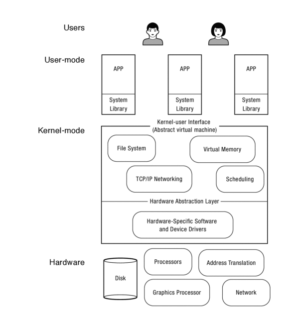
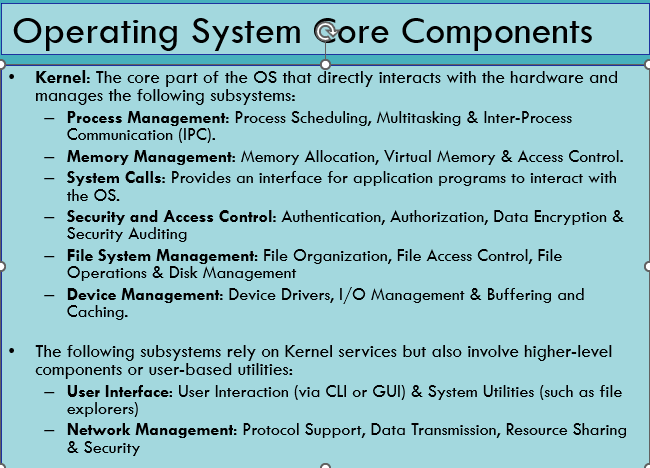

+++
title = 'Operating System TA'
date = 2024-11-14T01:05:42+08:00
draft = false
+++

# Operating System TA

### 此文档是为了让各位更好理解UWE-Neusoft操作系统课程的内容，其中经过阅读产出的解释会放上原文链接，此文档使用双语，便于各位复习考试。

## 目录

- [Basic Concept](#chapter-1-basic-concept)
  - [Related Concepts](#11-related-concepts)
    - [CPU](#111-cpu-中央处理器)
    - [Register](#112-register-寄存器)
    - [RAM](#113-ram-内存)
    - [Latency Numbers](#114-latency-numbers-every-programmers-should-know)
  - [Operating System Definition](#12-operating-system-definition)
- [Process & Threads](#chapter-2-process--threads)
- [Concurrency](#chapter-3-concurrency)
- [System Calls](#chapter-4-system-calls)

## Chapter 1 Basic Concept
### 1.1 Related Concepts
#### **1.1.1 CPU 中央处理器**
CPU（Central Processing Unit，中央处理单元）是计算机的核心部件之一，负责执行计算机程序中的指令。它是计算机中的“大脑”，进行数据处理、运算、逻辑判断、控制指令执行等重要任务。简而言之，CPU负责将软件程序中的指令转化为计算机能够理解并执行的操作。

CPU 的主要工作包括：

- 指令执行：CPU 根据程序中给定的指令（比如加法、减法、逻辑判断等）进行操作。
- 数据处理：CPU 处理数据，进行算术运算、逻辑运算、数据传输等。
- 控制功能：CPU 控制计算机的各个部件，协调不同硬件的工作，以确保程序顺利运行。

--- 

#### **1.1.2 Register 寄存器**

**寄存器**（Register）是计算机中的一种 **高速存储器**，它位于 CPU 内部，专门用于存储和快速访问正在处理的数据和指令。与内存（RAM）相比，寄存器的访问速度非常快，因为它直接集成在 CPU 内部，但它的存储容量较小。寄存器在计算机的执行过程中扮演着至关重要的角色，尤其是在指令的解码、执行和数据操作方面。

寄存器的类型和作用

根据功能和使用方式，寄存器可以分为不同的类型。

#### 1. **数据寄存器（Data Registers）**
- **作用**：用于存储在运算过程中需要处理的数据。
- **示例**：在加法运算中，两个操作数可能会被加载到数据寄存器中，然后 CPU 对它们进行计算。

#### 2. **地址寄存器（Address Registers）**
- **作用**：存储内存地址，用于指示数据在内存中的位置。
- **示例**：当程序需要从内存中读取数据时，地址寄存器保存着数据所在的内存地址，CPU 使用该地址从内存中获取数据。

#### 3. **指令寄存器（Instruction Register, IR）**
- **作用**：存储当前正在执行的指令。
- **示例**：CPU 在执行程序时，会将程序中的指令加载到指令寄存器中进行解码，然后执行。

#### 4. **程序计数器（Program Counter, PC）**
- **作用**：存储下一条将要执行的指令的地址。
- **示例**：当 CPU 执行完当前指令后，程序计数器会自动更新，指向下一条指令的地址。

#### 5. **状态寄存器（Status Register）**
- **作用**：存储 CPU 的状态信息，包括算术运算的结果（如零标志、进位标志等）。
- **示例**：如果执行加法操作的结果为零，状态寄存器中的 **零标志** 会被设置为 1，表示运算结果为零。

#### 6. **通用寄存器（General Purpose Registers, GPR）**
- **作用**：供 CPU 用于存储临时数据或计算结果，通常用于数据处理。
- **示例**：例如在汇编语言中，可以使用通用寄存器保存操作数或者暂时存储中间计算结果。

#### 7. **浮点寄存器（Floating Point Registers）**
- **作用**：专门用于处理浮点数（即带有小数点的数字）的计算。
- **示例**：在执行浮点运算时，浮点寄存器存储浮点数的值。

**寄存器在 CPU 中的作用**

寄存器是 CPU 内部最关键的组成部分之一，它们直接影响计算机的运算效率和处理速度。以下是寄存器在 CPU 中的主要作用：

1. **高速存储**：
   - 寄存器是 CPU 内部最快的存储器，通常比缓存（Cache）和主存（RAM）更快。因为它们是 CPU 的一部分，所以可以在指令执行过程中实时访问。

2. **存储操作数和中间结果**：
   - 在 CPU 执行计算时，寄存器用于存储操作数和计算过程中的中间结果。例如，进行加法运算时，两个操作数和运算结果都可能保存在寄存器中。

3. **提高运算速度**：
   - 寄存器的高速存取特性显著提高了 CPU 的运算速度。每次计算指令时，数据如果保存在寄存器中，CPU 能够迅速地获取并进行计算，而不需要从较慢的内存中读取数据。

4. **指令调度与执行**：
   - **程序计数器**（PC）和 **指令寄存器**（IR）是 CPU 执行程序指令的核心部件。程序计数器指向下一条指令的地址，而指令寄存器则保存当前执行的指令。指令的取出、解码、执行是通过寄存器高效完成的。

5. **数据传递**：
   - 寄存器负责 CPU 内部和内存、外设之间的数据传递。通过寄存器，CPU 可以与内存中的数据进行交换，也可以与外设（如硬盘、显示器等）进行数据交换。

**寄存器的特性**

1. **速度快**：
   - 寄存器是 CPU 中的最重要部件，存取速度极快，通常是硬件直接支持的。

2. **容量小**：
   - 由于寄存器存储的是临时数据，它们的容量比内存要小很多。一个现代 CPU 通常只有几十到几百个寄存器，而内存的容量则是几 GB 或更多。

3. **专用性**：
   - 大多数寄存器有专门的用途，例如程序计数器（PC）和指令寄存器（IR）有固定的用途，不能随意改动；而通用寄存器则可以被程序灵活使用。

4. **易于访问**：
   - 由于寄存器直接位于 CPU 内部，CPU 可以非常迅速地访问和操作它们。

---

#### **1.1.3 RAM 内存**
### 什么是内存？

**内存**（Memory）是计算机中用于存储数据和指令的硬件设备，它为计算机提供临时存储空间，使得处理器（CPU）能够快速访问正在使用的数据和程序指令。内存是计算机运行时必不可少的组成部分，它的主要作用是提供程序和数据的存取，使得 CPU 能够在运行程序时不断地读取和修改数据。

在计算机中，内存有不同的类型，根据速度、容量、用途等因素进行区分。最常见的内存类型包括 **RAM（随机存取存储器）** 和 **ROM（只读存储器）**，以及一些特殊的高速缓存（如 **Cache**）和虚拟内存。

#### 内存的主要分类

#### 1. **RAM（随机存取存储器）**
- **作用**：RAM 是计算机的主内存，主要用于存储正在运行的程序和数据。RAM 可以随时读写，因此它被称为“随机存取”的内存。
- **特点**：
  - **易失性**：RAM 中的数据在计算机断电后会丢失，所以它被称为易失性内存。计算机重启后，内存中的数据会消失，操作系统和程序需要重新加载到内存中。
  - **读写速度快**：RAM 的访问速度相对较快，远远高于硬盘或固态硬盘（SSD）。
- **类型**：
  - **动态 RAM（DRAM）**：常见的 RAM 类型，具有较大的存储容量，但需要定期刷新以保持数据。
  - **静态 RAM（SRAM）**：速度更快，但容量较小，通常用于 CPU 缓存（L1、L2、L3 缓存）中。

#### 2. **ROM（只读存储器）**
- **作用**：ROM 是一种非易失性内存，存储的是计算机开机时需要的固化指令或数据，如 BIOS（基本输入输出系统）或固件。
- **特点**：
  - **非易失性**：ROM 中存储的数据即使断电也不会丢失。
  - **只能读取**：传统的 ROM 只能读取数据，不能像 RAM 那样随意写入。现代 ROM 如 **EPROM** 和 **EEPROM** 可以进行编程和擦除，但写入次数有限。

#### 3. **缓存（Cache）**
- **作用**：缓存是位于 CPU 和主内存之间的一种高速存储器，旨在提高 CPU 访问内存的速度。缓存存储着 CPU 频繁访问的数据或指令，避免了 CPU 每次都从较慢的 RAM 中获取数据。
- **特点**：
  - **极高的访问速度**：由于缓存速度远高于内存，它可以大大减少 CPU 等待内存访问的时间。
  - **小容量**：缓存的存储容量相较于 RAM 和硬盘非常小，但它能够极大地提高计算机的性能。
  - **多级缓存**：现代 CPU 通常配有多级缓存（L1、L2、L3 缓存），不同级别的缓存具有不同的容量和访问速度。

#### 4. **虚拟内存**
- **作用**：虚拟内存是计算机操作系统管理内存的一种方式，它使得计算机看起来拥有比实际物理内存更多的可用内存。虚拟内存通过将不常用的数据暂时存储在硬盘上来扩展内存空间。
- **特点**：
  - **硬盘与内存交换**：当物理内存不够用时，操作系统会将一些数据从 RAM 移动到硬盘的交换文件（Swap）或页面文件中，这个过程叫做 **分页**（paging）。
  - **提供更多空间**：虚拟内存允许程序使用比物理内存更多的空间，但由于硬盘速度远慢于内存，这会导致性能下降。

#### 内存的工作原理

1. **程序加载**：
   - 当你启动一个程序时，操作系统会将程序的代码和所需的数据从硬盘加载到内存中。操作系统会为每个程序分配一定的内存空间，使得程序可以在内存中运行。

2. **数据存取**：
   - CPU 通过访问内存中的数据来执行指令。内存是一个 **地址空间**，每个数据和指令都有一个唯一的地址，CPU 根据这些地址来读取或写入数据。
   - CPU 可以通过 **内存总线** 与内存进行通信，读取数据、存储数据或修改数据。

3. **缓存和内存层次结构**：
   - 由于 CPU 访问内存的速度远慢于寄存器和缓存，现代计算机通常采用层次化的内存结构，其中包括多个缓存（L1、L2、L3）以及主内存（RAM）。CPU 会首先尝试从速度最快的 L1 缓存中获取数据，如果没有找到，则依次从 L2、L3 缓存，最终从主内存中获取。

4. **虚拟内存的使用**：
   - 当程序需要更多内存时，操作系统会使用虚拟内存技术，将部分内存内容保存到硬盘上。这种做法能够扩展可用内存，但也会因硬盘访问速度慢而导致性能下降。

#### 内存与其他硬件的比较

| **硬件**  | **速度**  | **容量**  | **易失性**  | **用途**  |
|-----------|-----------|-----------|-------------|-----------|
| **寄存器** | 极快      | 极小      | 易失性       | 存储 CPU 当前处理的数据和指令 |
| **缓存（Cache）** | 很快      | 小        | 易失性       | 存储 CPU 常用的数据和指令，减少访问内存的延迟 |
| **RAM**   | 快        | 中        | 易失性       | 存储正在运行的程序和数据 |
| **ROM**   | 慢        | 小        | 非易失性     | 存储固化的程序和数据（如 BIOS） |
| **硬盘（HDD/SSD）** | 慢        | 大        | 非易失性     | 存储长期数据，如操作系统、程序和文件 |

---

#### **1.1.4 Latency Numbers Every Programmers Should Know**
在后续的课程开始之前，阅读此章节是有意义的，能让各位更直观的了解到不同的硬件的访问延迟速度的不同之处。
**"Latency Numbers Every Programmer Should Know"** 是一篇由 **John L. Hennessy** 和 **David A. Patterson**（计算机体系结构领域的两位权威人物）提出的文章，旨在帮助程序员了解不同硬件操作的延迟（latency）数字，并通过这些数字更好地优化程序的性能。文章中的数据主要描述了现代计算机系统中，常见硬件组件（如 CPU 寄存器、缓存、内存、硬盘等）的访问延迟。

#### 典型延迟数据

这些数字是针对典型硬件平台的延迟时间，按不同层级和硬件分类：

1. **CPU 寄存器**：
   - 访问延迟：**1ns**（极快）

2. **L1 缓存**（Level 1 Cache）：
   - 访问延迟：**1ns – 4ns**

3. **L2 缓存**（Level 2 Cache）：
   - 访问延迟：**3ns – 20ns**

4. **L3 缓存**（Level 3 Cache）：
   - 访问延迟：**10ns – 40ns**

5. **主内存（RAM）**：
   - 访问延迟：**50ns – 100ns**

6. **固态硬盘（SSD）**：
   - 访问延迟：**100µs**（微秒级别）

7. **机械硬盘（HDD）**：
   - 访问延迟：**5ms – 10ms**（毫秒级别）

8. **网络存储（如 NAS 或云存储）**：
   - 访问延迟：**10ms – 100ms**

这些数据帮助开发人员理解，在不同硬件和存储层次中，数据访问的速度差异是多么显著，尤其是在考虑性能优化时。程序员可以通过了解这些延迟数字来识别性能瓶颈，比如频繁地访问主内存、硬盘或者网络存储会导致程序的性能大幅下降。

#### 数据可信性

这些数字来自实际的硬件测试和研究，因此它们在一般情况下是具有很高的可信度的。不过，这些延迟数字是 **典型值** 或 **平均值**，并且会受到不同硬件平台、处理器架构、存储设备类型等因素的影响。也就是说，不同的计算机系统可能会有所不同，特别是在新的硬件和存储技术（如 NVMe SSD、Optane 存储）出现时，延迟时间可能会有所变化。

另外，**操作系统** 和 **硬件配置**（如内存大小、缓存层次、硬盘类型、网络带宽等）都会对实际性能产生影响，因此这些延迟数字可以作为参考，但并不意味着每种硬件都严格符合这些标准。

#### 为什么这些数据重要？

1. **性能优化**：了解这些延迟数字能够帮助开发人员在程序中进行优化，避免不必要的性能瓶颈。例如，频繁访问主内存会比访问 CPU 缓存慢得多，因此程序应尽量减少内存访问的频率，并尝试使用缓存。

2. **设计高效算法**：程序员可以通过了解存储层次的延迟，选择合适的数据结构和算法，最大限度地提高程序的运行效率。例如，当设计缓存策略时，知道 L1 和 L2 缓存的访问速度差异可以帮助设计高效的缓存替换算法。

3. **硬件依赖性**：这些延迟数据有助于程序员理解程序在不同硬件平台上运行的行为，尤其是在进行性能调优时。这些数字帮助程序员识别哪些硬件是性能瓶颈，并做出相应的优化。

4. **虚拟内存和磁盘I/O**：在虚拟内存管理和文件系统设计中，理解硬盘和主内存之间的延迟差异至关重要。通过了解硬盘延迟是如何影响性能的，程序员可以更好地设计内存分页、缓存和数据交换机制。

推荐大家使用此链接的图来直观观察1990-2020年访问速度的差异： https://colin-scott.github.io/personal_website/research/interactive_latency.html

___

### 1.2 Operating System Definition
> An Operating System (OS) is software that acts as an interface between the computer hardware and the user or application software. It manages hardware resources and provides essential services for the execution of programs. (From **lecture 10**)

我们如何来理解上面这段话？

当我们想要更全面理解一个定义时，一个通常比较好的方法是查看其他书籍和行业先驱对个概念的定义和理解，找到不同定义的相同点，进而形成一个准确又直观的感受框架，再将我们学习到和接触到的知识放入框架中一步一步完善。我们尝试从另外两本比较优秀的教材中理解这一定义。

**定义1**

> The job of an operating system is to share a computer among multiple programs and to provide a
more useful set of services than the hardware alone supports. An operating system manages and
abstracts the low-level hardware, so that, for example, a word processor need not concern itself
with which type of disk hardware is being used. An operating system shares the hardware among
multiple programs so that they run (or appear to run) at the same time. Finally, operating systems
provide controlled ways for programs to interact, so that they can share data or work together.

**中文翻译版：**

> 操作系统的任务是将计算机资源在多个程序之间进行共享，并提供比硬件本身支持的功能更为丰富的服务。操作系统管理和抽象了底层硬件，例如，使得文字处理器无需关心正在使用哪种类型的磁盘硬件。操作系统将硬件资源在多个程序之间共享，使它们可以同时运行（或看起来像同时运行）。最后，操作系统提供了受控的方式供程序之间进行交互，使它们能够共享数据或协同工作。

(*xv6, a simple, Unix-like teaching operating system, Russ Cox Frans Kaashoek Robert Morris*, September 6, 2021)

**定义2：**
> An operating system (OS) is the layer of software that manages a computer’s resources for
its users and their applications. Operating systems run in a wide range of computer
systems. They may be invisible to the end user, controlling embedded devices such as
toasters, gaming systems, and the many computers inside modern automobiles and
airplanes. They are also essential to more general-purpose systems such as smartphones,
desktop computers, and servers.

**中文翻译版**

> 操作系统（OS）是管理计算机资源的软体层，负责为用户及其应用程序提供服务。操作系统运行于各种计算机系统中。它们可能对最终用户是不可见的，控制着嵌入式设备，如烤面包机、游戏系统以及现代汽车和飞机中的许多计算机。它们对更通用的系统，如智能手机、桌面计算机和服务器，也是至关重要的。

（*Operating Systems Principles & Practice， Thomas Anderson, Mike Dahlin*）

从以上三种定义我们可以看出操作系统的核心概念：
  
- 操作系统是管理计算机硬件资源(hardware resources)的**软件**。
- 作为硬件和**用户**的中介角色，为用户提供对硬件直接操作的直观服务。
- 作为硬件和**用户程序**的中介角色，为用户提供对硬件间接操作的直观服务。
- 提供**可控制的程序交互**，使得不同的程序可以共享数据和一起工作。

**Figure 1.1 general-purpose operating system**:  这张图可以从整体描述用户和计算机硬件之间的关系，一般而言，用户与软件应用（app)进行交互，而这些app运行在操作系统搭载的环境中，而操作系统作为一个中介来跟底层的硬件交互。
我们看一下这张简单图示的扩展版
 （***Figure 1.3 Operating Systems Principles & Practice， Thomas Anderson, Mike Dahlin***)

这张图更详细的描述了操作系统的功能，在最低层，硬件提供了处理器（Processors, Graphics Processor)、内存(Memory)以及一组用于存储数据(Disk)和与外界通信的设备(Network)。硬件还提供了一些基本操作，供操作系统用于故障隔离和同步(fault isolation and synchronization)。操作系统运行在计算机上作为最低层的软件。它包含一个用于管理各种硬件设备的设备专用层（device-specific layer），以及一组提供给应用程序的设备无关服务（device-independent services）。由于操作系统必须隔离恶意和有漏洞的应用程序，防止它们干扰其他应用程序或操作系统本身，因此操作系统的大部分运行在一个与应用程序代码分离的、受到保护的执行环境中。此外，操作系统的一部分也可以作为系统库运行，并链接到每个应用程序中。
反过来，应用程序运行在由操作系统内核提供的执行上下文中。这个应用程序上下文不仅仅是硬件设备之上的一个简单抽象；它是一个虚拟环境，具有以下特点：

- 更加受限：为了防止对系统的破坏。
- 更加强大：以掩盖硬件的局限性。
- 更有用：通过提供常用服务，使应用程序更易开发和运行。

著名的 *Operating Systems Principles & Practice* 将操作系统描述为三种角色裁判（Referee)、幻术师（Illusionist)、胶水（Glue）。为避免太多信息对各位的阅读造成麻烦，我只简要介绍这三种角色的功能：

1. **裁判（Referee）**  
   操作系统管理在**同一台物理机器**上运行的**不同应用程序**之间共享的资源。例如，操作系统可以停止一个程序并启动另一个程序。操作系统将应用程序彼此隔离，因此，一个应用程序中的错误不会破坏在同一机器上运行的其他应用程序。操作系统还必须保护自身及其他应用程序免受恶意计算机病毒的攻击。由于应用程序共享物理资源，操作系统需要决定哪些应用程序可以获得哪些资源以及何时获取。

2. **幻术师（Illusionist）**  
   操作系统通过对物理硬件的抽象，简化了应用程序的设计。编写一个“Hello, world!”程序时，你不需要（也不想）考虑系统有多少物理内存，或者有多少其他程序可能在共享计算机的资源。相反，操作系统提供了一种**近乎无限内存**的幻觉，即使物理内存有限。同样，它们还提供了每个程序独占计算机处理器的幻觉，而实际情况显然不同！这种幻觉让你可以在不依赖系统物理内存大小或处理器数量的情况下编写应用程序。由于应用程序是基于更高层次的抽象编写的，操作系统可以在后台无形地改变分配给每个应用程序的资源量。

3. **胶水（Glue）**  
   操作系统提供了一组通用服务，以便应用程序之间可以方便地共享资源。因此，剪切和粘贴可以在整个系统中统一工作；一个应用程序写入的文件可以被另一个应用程序读取。许多操作系统还提供了通用的用户界面例程，使得应用程序可以具有相同的“外观和风格”。最重要的是，操作系统提供了一层将应用程序与硬件输入/输出（I/O）设备隔离的抽象层，因此应用程序的编写无需依赖于特定的键盘、鼠标或磁盘驱动器，而是可以独立于具体的硬件设备运行。 

各位可以使用上述的概念来更好地理解 Lecture 10 page 4的内容：

比如， 当 Process Management 时，操作系统作为一个 Referee 可以停止一个程序并启动另一个程序(Process Scheduling), 决定哪些应用程序可以获得哪些资源以及何时获取，并且作为胶水提供了multitasking之间的一组通用服务，确保一个应用程序写入的文件可以被另一个应用程序读取(Multitasking & Inter-Process Communication)。

## Chapter 2 Process & Threads
***本章节的顺序稍微不同于课程顺序，我将先解释什么是 Process，然后再解释Process Management相关的问题。**
### 2.1 What is Process
首先我们回顾一下课程上关于进程（Process)的定义：

"Process in execution" 指的是在运行中的程序，这是进程与代码不同的地方，代码是指令集的集合。
为了更全面的理解什么是进程（Process）我们可以回顾一下
### What is Process Management
### 
## Chapter 3 Concurrency

## Chapter 4 System Calls
